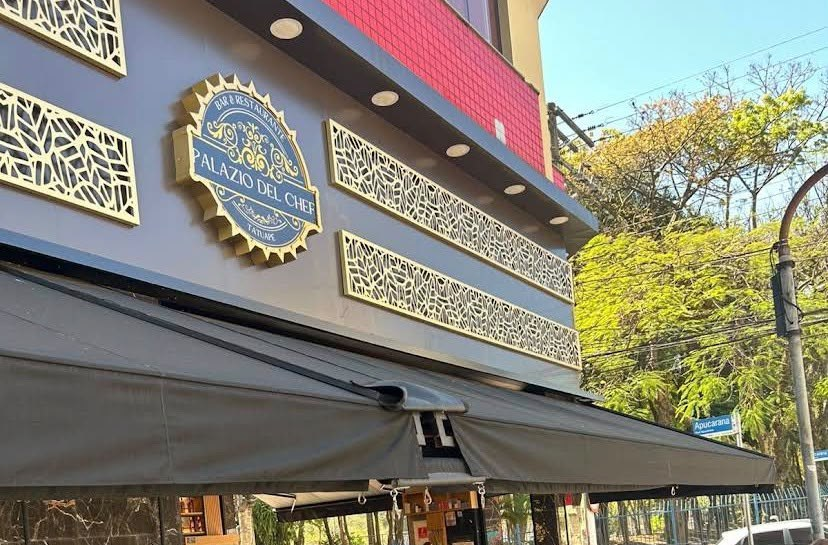
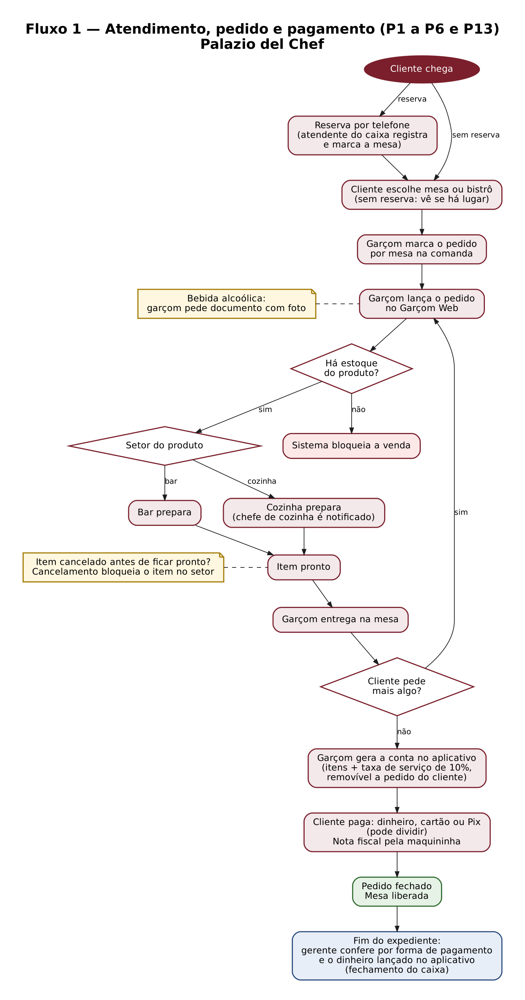
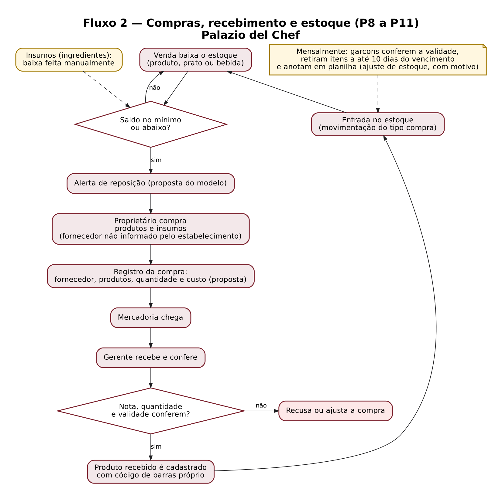
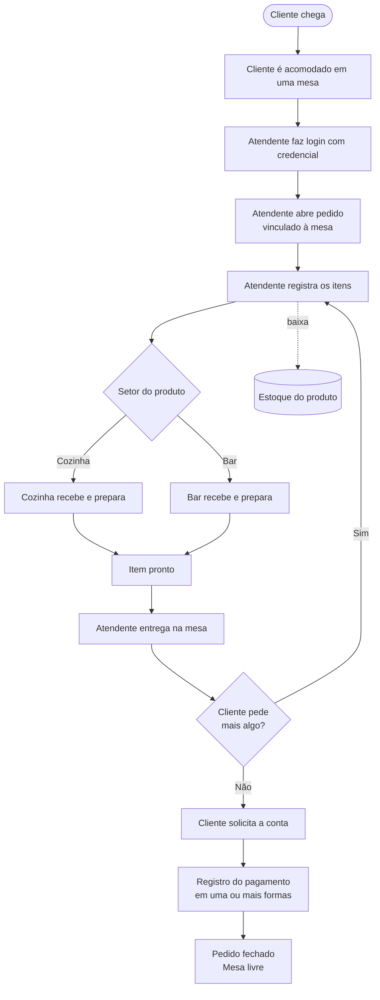
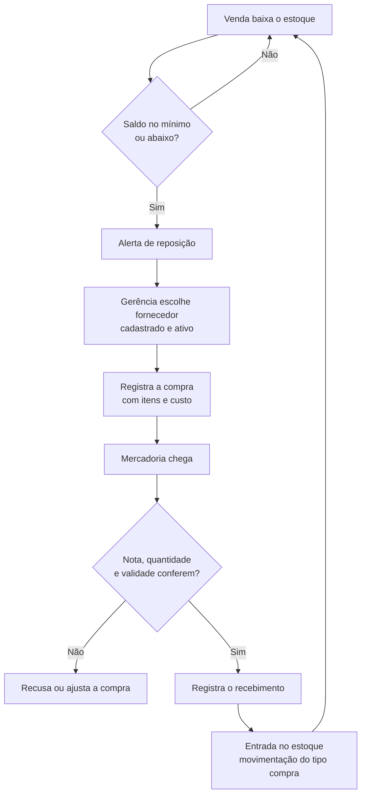
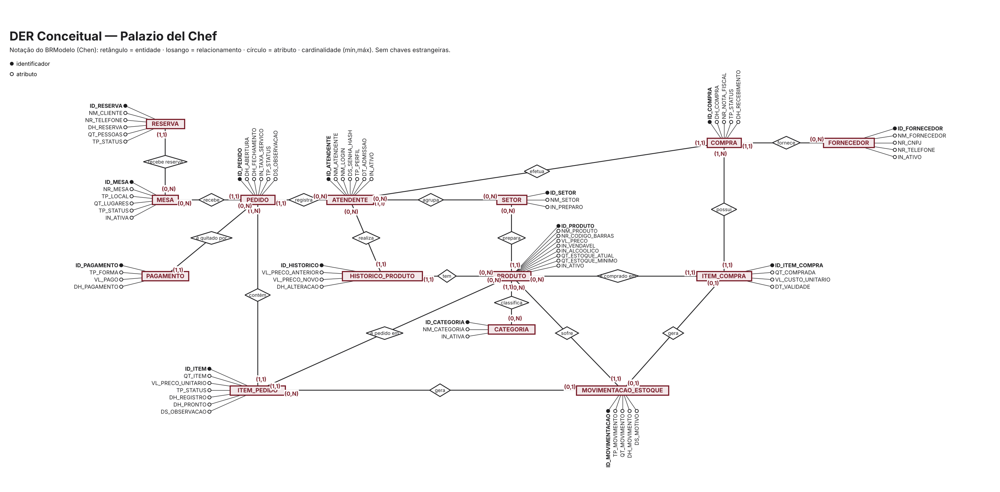
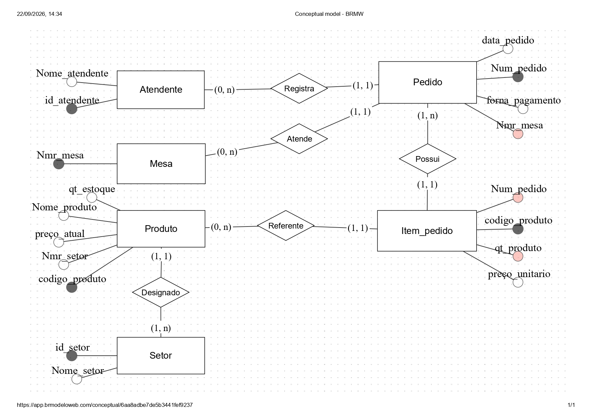
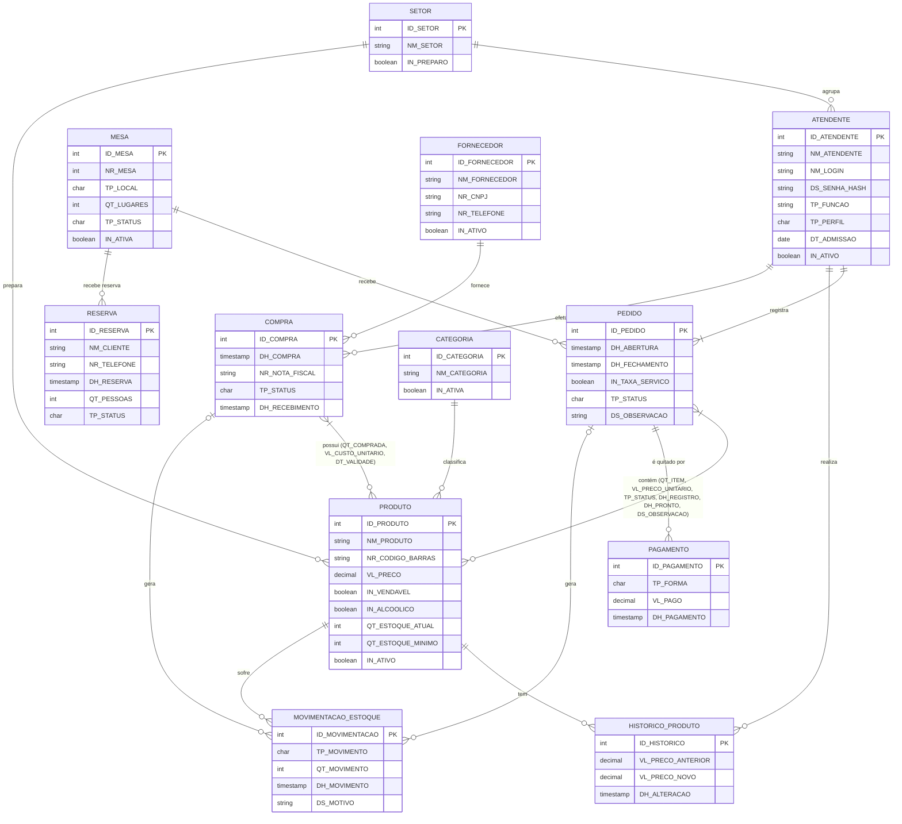

# 🍽️ Projeto: Palazio del Chef
### Entrega 1 — Modelo Conceitual (DER)

<p align="center">
  
  
</p>

> **Como ler os marcadores deste arquivo** *(apague este bloco antes de entregar)*
> - **`[VALIDAR]`** — informação proposta na organização do texto, que precisa ser confirmada com o grupo ou no estabelecimento.
> - **`[PREENCHER]`** — dado que só o grupo tem (RGM, endereço, contato, fotos etc.).
> - **`(proposta)`** — regra, requisito, processo ou entidade **nova**, que não estava no README original. O grupo decide se mantém ou remove.
> - Itens marcados **`(original)`** vieram do README anterior do grupo.
> - **Nada marcado como `(proposta)` foi observado no estabelecimento.** A pesquisa de campo é que confirma ou descarta cada item.

---

## 👥 Metadados

| Integrante | RGM |
|------------|-----|
| Raphael Luiz Lima de Araujo | 46995773 |
| Ricardo Santos Marcelino | 47023708 |
| Thiago Rodrigues Ribeiro | 47188049 |
| Victor Sousa dos Anjos | 47333235 |

- **Curso / Disciplina:** Análise e Desenvolvimento de Sistemas — Modelagem de Banco de Dados (UNICID) — Prof. Cid Andrade
- **Versão do documento:** v2.0 — 07/10/2026

---

## 1. 📖 Caracterização da Organização

- **Nome e natureza:** **Palazio del Chef** — estabelecimento do segmento de alimentação, com características de **restaurante e bar**, com fins lucrativos.
- **Contexto e porte:** restaurante e bar no Tatuapé (São Paulo), com um único cardápio (o mesmo no almoço e à noite, com pratos e bar) e entrega por telefone (delivery). O salão tem cerca de **30 mesas e 25 bistrôs** (estimativa do grupo) e o movimento é de **150 a 300 pedidos** por dia em dias de semana e de **400 a 550 pedidos** aos sábados (estimativa do grupo). A operação é dividida entre **salão** (garçons), **cozinha**, **bar**, **gerência** e **limpeza**, com funcionários CLT em escala 6x1. O grupo classifica o porte como **baixo a médio**.

| Dado de porte | Valor |
|---------------|-------|
| Número de mesas | Cerca de 30 mesas e 25 bistrôs (estimativa) |
| Setores com funcionários | Salão (garçons), cozinha, bar, gerência e limpeza `[PREENCHER: quantidade em cada setor]` |
| Horário de funcionamento | Segunda a quarta: 06:00 às 23:00 · Quinta a sábado: 06:00 às 00:00 · Domingo: 11:00 às 18:00 (conforme o Google Maps; print em [`evidencias/`](./evidencias/horario_google_maps.jpg)) |
| Pedidos (estimativa por dia) | 150 a 300 em dias de semana; 400 a 550 aos sábados |
| Itens no cardápio | Mais de 260 preços, em cerca de 45 grupos (lanches, pratos, porções, sobremesas, sucos, caipirinhas, drinks, cervejas, chopp, doses etc.). Ver [`evidencias/`](./evidencias/) |
| Como os pedidos são registrados hoje | Comanda, marcada por mesa. Os garçons também lançam o pedido no aplicativo **Garçom Web** |
| Regime de trabalho | CLT, escala 6x1 |

- **Problemas e necessidades identificados:**
  - **Falta de controle dos atendentes (original):** a equipe não é registrada por credenciais. Isso dificulta saber quem registrou cada pedido e controlar as atividades feitas no sistema.
  - **Funcionários sem credenciais administrativas (informado na visita):** quem não é da gerência ou da direção não tem acesso individual de gestão. Compras e cadastros dependem de poucas pessoas e não ficam registrados por responsável.
  - **Compras sem registro estruturado (informado na visita):** as compras de produtos e insumos são feitas pelo proprietário. O recebimento é conferido pelo gerente. Não há registro de fornecedor nem de custo por compra.
  - **Validade e estoque em planilha (informado na visita):** uma vez por mês os garçons conferem a validade e retiram os itens a até 10 dias de vencer, anotando tudo em planilha. Não há alerta automático de reposição nem histórico de movimentação.
  - **Sistema atual:** o pedido é lançado no aplicativo **Garçom Web**, que o envia ao bar ou à cozinha, com aviso ao chefe de cozinha. O estoque e as compras ficam fora desse fluxo. `[VALIDAR: o que o Garçom Web já controla e o que o novo modelo deve cobrir]`
  - **Conferência dos pagamentos e do caixa (informado pelo grupo):** a maquininha gera a nota fiscal; tudo é separado e conferido antes de encerrar o expediente. O pagamento em dinheiro também é lançado no aplicativo do local.
- **Justificativa da escolha:** O estabelecimento foi escolhido pela sua estrutura operacional e pelos processos envolvidos no funcionamento (atendimento, produção em setores distintos, compras, estoque e pagamento), o que permite aplicar os conceitos de modelagem de banco de dados. O porte é adequado: tem processos e entidades suficientes, sem ser complexo demais para esta etapa. `[PREENCHER: como o grupo tem acesso ao local — ex.: vínculo com o proprietário]`
- **Evidências da organização:**

<p align="center">
  
</p>

| Evidência | Registro |
|-----------|----------|
| Endereço completo | Rua Apucarana, 480 — Tatuapé |
| CNPJ | 58.759.116/0001-99 |
| Link no Google Maps | [maps.app.goo.gl/TnAsUSbBUWyaUT7E9](https://maps.app.goo.gl/TnAsUSbBUWyaUT7E9) |
| Rede social | Instagram: [@palaziodelchef](https://www.instagram.com/palaziodelchef/) |
| Contato | Telefone (11) 2359-7134 · E-mail palaziodelchef@gmail.com |
| Responsável pela organização | Ivo Diogo Alcantara Parente, proprietário e sócio-administrador (informado na visita) |
| Datas das visitas | 04/09/2026 |
| Entrevista e observação | Resumo abaixo, com as informações da visita de 04/09/2026. Roteiro usado: [`evidencias/roteiro_entrevista.md`](./evidencias/roteiro_entrevista.md) |
| Cardápio | Cardápio do estabelecimento (o mesmo no almoço e à noite), em [`evidencias/`](./evidencias/cardapio_palazio_diurno.pdf) |
| Fotos da pesquisa de campo | Fachada com a placa "Palazio del Chef — Bar & Restaurante — Tatuapé" e a placa da Rua Apucarana (foto acima). A foto do salão não foi publicada, para não expor clientes. |
| Nome no Google Maps | "Palazio Del Chefe" (a placa da fachada diz "Palazio del Chef") |

**Resumo da visita de 04/09/2026** (informações repassadas pelo grupo, a partir do que foi visto e perguntado no local):

- O cliente chega e escolhe o lugar entre cerca de 30 mesas e 25 bistrôs, ou reserva por telefone. A atendente que fica no caixa registra a reserva no sistema e a marca pelo número da mesa. Quem não reservou entra e vê se há lugar.
- O pedido é marcado por mesa, na comanda. O **garçom** lança o pedido no aplicativo **Garçom Web**, que o encaminha ao **bar** ou à **cozinha** e notifica o chefe de cozinha para o preparo.
- Cada produto recebido é cadastrado com um **código de barras próprio**. Os pratos também existem no sistema, e tudo que sai aparece para eles. Se o produto não tem estoque, o sistema bloqueia a venda.
- O garçom também encaminha o preparo, cobra o cliente e gera a conta no aplicativo. O pagamento é em dinheiro, cartão ou Pix. É cobrada **taxa de serviço de 10%**.
- Um item pode ser cancelado no sistema do aplicativo, antes de ficar pronto, e o cancelamento também bloqueia o item na cozinha.
- Para bebida alcoólica, pedem **documento com foto**, por causa da proibição para menores de 18 anos.
- As **compras** de produtos e insumos são feitas pelo proprietário. Quem **recebe** a mercadoria é o gerente. Os fornecedores não foram informados.
- Os garçons conferem a **validade** uma vez por mês, retiram os itens a até 10 dias do vencimento e anotam tudo em planilha.
- Controlam o estoque de ingredientes, de pratos prontos e também de bebidas.
- A **nota fiscal** só vem pela maquininha de cartão, sem cupom no sistema.
- Os registros são guardados por semestre (meses 1 a 6 e meses 7 a 12). O fechamento do caixa é feito pelo gerente.
- Os funcionários são CLT, em escala **6x1**. Os funcionários não têm credenciais administrativas.

### 🎯 Objetivo do Projeto (original)

Analisar os processos do estabelecimento e desenvolver uma modelagem de banco de dados capaz de organizar as principais informações relacionadas ao **atendimento, pedidos, produtos, mesas, setores e atendentes**. Nesta versão, o escopo também cobre **pagamento, compras, fornecedores e controle de estoque** `(proposta)`.

---

## 2. 🗺️ Processos de Negócio

Os processos foram organizados em três grupos: **Vendas** (ciclo do atendimento), **Compras** (reposição de mercadoria) e **Apoio** (estoque, pessoas e caixa). A coluna *Origem* indica se o processo veio do README original ou é uma proposta a validar em campo.

### 2.1 Processos de Vendas

| # | Processo | Descrição | Entrada → Saída | Responsável | Entidades | Origem |
|---|----------|-----------|-----------------|-------------|-----------|--------|
| P1 | 🛎️ Atendimento e abertura de mesa | O cliente chega e é acomodado em uma mesa ou bistrô (com ou sem reserva). O garçom abre o pedido da mesa, que passa a ocupada. | Cliente → pedido aberto na mesa | Garçom | MESA, PEDIDO, ATENDENTE | original / confirmado na visita |
| P2 | 📝 Registro do pedido | O garçom marca o pedido por mesa na comanda e o lança no aplicativo Garçom Web (produto, quantidade, observação). O preço do cardápio é copiado para o item e o estoque é baixado. Sem estoque, o item é bloqueado. | Pedido do cliente → itens pendentes | Garçom | PEDIDO, PRODUTO (relacionamento contém) | original / confirmado na visita |
| P3 | 🏃 Encaminhamento para cozinha e bar | Depois do lançamento, o pedido é encaminhado ao bar ou à cozinha, com notificação ao chefe de cozinha para o preparo. | Item pendente → fila do setor | Garçom / sistema | PEDIDO, PRODUTO (contém), SETOR | original / confirmado na visita |
| P4 | 🍳 Preparo | O setor prepara o item e o marca como em preparo e depois como pronto. O atendente entrega e marca como entregue. | Item na fila → item entregue | Cozinha / Bar / Atendente | PEDIDO, PRODUTO (contém) | original |
| P5 | 💳 Fechamento da conta e pagamento | O garçom gera a conta no aplicativo e cobra o cliente. A conta soma os itens e a **taxa de serviço de 10%**. O pagamento é em dinheiro, cartão ou Pix, podendo ser dividido. Com a conta quitada, o pedido é fechado e a mesa é liberada. A nota fiscal vem pela maquininha de cartão. | Pedido entregue → pedido fechado, mesa livre | Garçom | PEDIDO, PAGAMENTO, MESA | original / confirmado na visita |
| P6 | 📅 Reservas | O cliente reserva mesa por telefone. No dia, a reserva vira o atendimento da mesa. Quem não reservou entra e vê se há lugar. A atendente que fica no caixa registra a reserva no sistema do estabelecimento e a marca pelo número da mesa. | Pedido de reserva → mesa reservada | Atendente do caixa |  RESERVA, MESA | confirmado na visita |
| P7 | 📋 Cadastro de cardápio e preços | Cada produto recebido é cadastrado com código de barras próprio, e os pratos também existem no sistema. O cardápio tem categorias (lanches, pratos, porções, bebidas etc.). Cada reajuste de preço fica no histórico, com responsável e data. `[VALIDAR: quem cadastra e reajusta]` | Decisão de preço → cardápio atualizado | Gerência `[VALIDAR]` | PRODUTO, CATEGORIA, HISTORICO_PRODUTO, SETOR | confirmado na visita / proposta |

### 2.2 Processos de Compras

| # | Processo | Descrição | Entrada → Saída | Responsável | Entidades | Origem |
|---|----------|-----------|-----------------|-------------|-----------|--------|
| P8 | 🛒 Compra de insumos e bebidas | O proprietário compra produtos e insumos. Neste modelo, a compra passa a ser registrada com fornecedor, itens, quantidades e custo, a partir do alerta de estoque mínimo. | Alerta de estoque → compra registrada | Proprietário | COMPRA, PRODUTO (relacionamento possui) | confirmado na visita (quem compra) / proposta (registro) |
| P9 | 🏭 Cadastro de fornecedores | O estabelecimento **não quis informar** os fornecedores. O modelo propõe cadastrá-los (nome, CNPJ, telefone), sem dados reais do Palazio. Só se compra de fornecedor cadastrado e ativo. | Dados do fornecedor → fornecedor ativo | Proprietário / gerência | FORNECEDOR | proposta (fornecedores reais não informados) |
| P10 | 📦 Recebimento de mercadorias | O gerente recebe a mercadoria. Cada produto recebido é cadastrado com código de barras próprio. Neste modelo, o recebimento registra nota fiscal, quantidade e validade e gera a entrada no estoque. | Mercadoria + nota → entrada de estoque | Gerente | COMPRA, PRODUTO (possui), MOVIMENTACAO_ESTOQUE | confirmado na visita (quem recebe) / proposta (registro) |

### 2.3 Processos de Apoio

| # | Processo | Descrição | Entrada → Saída | Responsável | Entidades | Origem |
|---|----------|-----------|-----------------|-------------|-----------|--------|
| P11 | 📊 Controle de estoque e validade | Hoje, controlam o estoque de ingredientes, pratos prontos e bebidas, e os garçons conferem a validade uma vez por mês, retiram os itens a até 10 dias do vencimento e anotam em planilha. Neste modelo, toda venda, compra, estorno e ajuste (perda, vencimento) gera uma movimentação, e o saldo é a soma delas. Abaixo do mínimo, há alerta de reposição. | Evento de estoque → saldo atualizado e alerta | Garçons (validade) / gerência `[VALIDAR]` | PRODUTO, MOVIMENTACAO_ESTOQUE | confirmado na visita (validade) / proposta (movimentação) |
| P12 | 🧑‍🍳 Cadastro de atendentes e escalas | Os funcionários são CLT, em escala 6x1 (seis dias de trabalho e um de folga), e hoje não têm credenciais individuais de gestão. Neste modelo, cada funcionário recebe cadastro com credencial, setor e perfil de acesso. Funcionário desligado é inativado, não excluído. A escala de folgas é rotina de RH e não está modelada nesta versão. | Contratação → atendente ativo com acesso | Gerência `[VALIDAR]` | ATENDENTE, SETOR | original / confirmado na visita (6x1) |
| P13 | 💰 Caixa e fechamento diário | Antes de encerrar o expediente, o gerente confere os pagamentos, que ficam separados por forma (a maquininha gera a nota fiscal e o dinheiro também é lançado no aplicativo do local). No modelo, é uma consulta sobre os pagamentos do dia, sem entidade própria. | Pagamentos do dia → conferência do caixa | Gerente | PAGAMENTO, PEDIDO | confirmado (quem fecha e como confere) / proposta (consulta) |

### 2.4 Como os processos se integram

- **Vendas → Estoque:** o lançamento de cada item (P2) baixa o estoque (P11). O cancelamento de um item pendente estorna a baixa.
- **Estoque → Compras:** o saldo no mínimo ou abaixo (P11) dispara a compra (P8) a um fornecedor cadastrado (P9).
- **Compras → Estoque:** o recebimento (P10) gera a entrada de estoque (P11) e registra a validade dos perecíveis.
- **Cardápio → Vendas:** só produto ativo e com estoque entra em um pedido. O preço vigente (P7) é copiado para o item (P2).
- **Reservas → Vendas:** a reserva (P6) garante a mesa; no dia, o atendimento abre o pedido (P1) na mesma mesa.
- **Pessoas → todos:** nenhum processo ocorre sem atendente autenticado (P12). Por isso cada pedido, compra e reajuste tem um responsável.
- **Vendas → Caixa:** os pagamentos (P5) alimentam o fechamento diário (P13).

### 2.5 Fluxogramas

Clique na imagem para abrir em tamanho original (PNG; também há versão SVG na mesma pasta).

[](./Fluxograma_Palazio_del_Chef/fluxo_vendas.png)

[](./Fluxograma_Palazio_del_Chef/fluxo_compras.png)

Fontes das imagens: [`fluxo_vendas.dot`](./Fluxograma_Palazio_del_Chef/fluxo_vendas.dot) e [`fluxo_compras.dot`](./Fluxograma_Palazio_del_Chef/fluxo_compras.dot) (Graphviz). Abaixo, os mesmos fluxos em Mermaid, que o GitHub renderiza.

**Fluxo 1 — Atendimento, pedido e pagamento (P1 a P5):**



**Fluxo 2 — Compras, recebimento e estoque (P8 a P11):**



---

## 3. ⚙️ Requisitos do Sistema

### 3.1 Requisitos Funcionais

| Código | Requisito | Processo | Origem |
|--------|-----------|----------|--------|
| RF01 | O sistema deve permitir que o atendente registre um pedido de forma eficiente. | P2 | original |
| RF02 | O sistema deve cadastrar atendentes com credenciais individuais (login e senha), setor e perfil de acesso. | P12 | proposta (resolve o problema identificado) |
| RF03 | O sistema deve exigir autenticação do atendente antes de registrar ou alterar um pedido. | P2 | proposta |
| RF04 | O sistema deve vincular cada pedido a uma mesa e ao atendente que o registrou. | P1 | proposta (formaliza as regras originais) |
| RF05 | O sistema deve permitir adicionar itens a um pedido aberto, com quantidade e observação. | P2 | proposta |
| RF06 | O sistema deve encaminhar cada item ao setor responsável pelo preparo (cozinha ou bar). | P3 | proposta |
| RF07 | O sistema deve permitir que cozinha e bar atualizem o status dos itens (em preparo, pronto) e o atendente, o de entregue. | P4 | proposta |
| RF08 | O sistema deve cadastrar produtos com código de barras, preço, setor de preparo e estoque mínimo. | P7 | proposta |
| RF09 | O sistema deve atualizar o estoque a cada venda e alertar quando o saldo atingir o mínimo. | P11 | proposta |
| RF10 | O sistema deve registrar o histórico de alterações de preço dos produtos, com responsável e data. | P7 | proposta |
| RF11 | O sistema deve calcular o total do pedido e registrar um ou mais pagamentos, por forma de pagamento. | P5 | proposta |
| RF12 | O sistema deve fechar o pedido somente após o pagamento integral e liberar a mesa. | P5 | proposta |
| RF13 | O sistema deve emitir relatórios de vendas por período, por atendente, por setor e por produto. | P5 | proposta |
| RF14 | O sistema deve permitir cancelar um item pendente ou um pedido, com estorno do estoque. | P2 | proposta |
| RF15 | O sistema deve cadastrar, alterar e inativar fornecedores. | P9 | proposta |
| RF16 | O sistema deve registrar compras a fornecedores, com os itens, as quantidades e o custo unitário. | P8 | proposta |
| RF17 | O sistema deve registrar o recebimento da compra, com nota fiscal e validade, e dar entrada no estoque. | P10 | proposta |
| RF18 | O sistema deve registrar ajustes de estoque (perda, quebra, vencimento) com motivo e responsável. | P11 | proposta |
| RF19 | O sistema deve listar os produtos no estoque mínimo ou abaixo, para reposição. | P11 | proposta |
| RF20 | O sistema deve apresentar o fechamento diário do caixa, com o total por forma de pagamento. | P13 | proposta `[VALIDAR]` |
| RF21 | O sistema deve permitir inativar atendentes, produtos e mesas, sem apagar o histórico. | P7, P12 | proposta |
| RF22 | O sistema deve registrar reservas de mesa, com data, hora, quantidade de pessoas e o contato do cliente. | P6 | confirmado na visita (existem reservas por telefone) |
| RF23 | O sistema deve agrupar os produtos em categorias do cardápio e marcar quais são bebidas alcoólicas. | P7 | proposta (a partir do cardápio) |
| RF24 | O sistema deve calcular a taxa de serviço de 10% sobre os itens, quando cobrada, e incluí-la na conta. | P5 | confirmado na visita |
| RF25 | O sistema deve bloquear o item cancelado também no setor de preparo. | P3 | confirmado na visita |

### 3.2 Requisitos Não Funcionais

| Código | Categoria | Requisito | Origem |
|--------|-----------|-----------|--------|
| RNF01 | Segurança | O sistema deve garantir que somente funcionários autorizados visualizem informações restritas do bar ou da cozinha. | original |
| RNF02 | Segurança | O sistema deve possuir controle de acesso por perfil (atendimento, preparo, gerência), garantindo confidencialidade conforme a permissão de cada usuário. | original |
| RNF03 | Segurança | As senhas devem ser armazenadas de forma criptografada (hash), nunca em texto puro. | proposta |
| RNF04 | Rastreabilidade | Toda ação relevante (pedido, item, pagamento, compra, ajuste de estoque, alteração de preço) deve registrar o atendente e a data e hora. | proposta |
| RNF05 | Integridade | Pedidos, itens, pagamentos e compras não podem ser excluídos fisicamente. A correção é feita por cancelamento ou inativação. | proposta |
| RNF06 | Usabilidade | O registro de pedidos deve ser rápido e utilizável em dispositivo móvel no salão. | proposta |
| RNF07 | Disponibilidade | O sistema deve estar disponível em todo o horário de funcionamento. | proposta |
| RNF08 | Desempenho | O lançamento de um item e a consulta da fila do setor devem responder em até 2 segundos em condições normais de uso. `[VALIDAR o limite]` | proposta |
| RNF09 | Consistência | O saldo de estoque e o total do pedido devem ser sempre coerentes com as movimentações e os itens (sem divergências). | proposta |
| RNF10 | Privacidade (LGPD) | O sistema deve guardar apenas os dados pessoais necessários e restringir o acesso a eles. Os logs de acesso devem ser mantidos. | proposta |
| RNF11 | Recuperação | Deve haver cópia de segurança diária do banco, com restauração testada. | proposta |
| RNF12 | Manutenibilidade | O modelo deve permitir novos setores, formas de pagamento e produtos sem alterar a estrutura das tabelas. | proposta |

---

## 4. 📜 Regras de Negócio

### 4.1 Regras operacionais

| Código | Processo | Regra | Origem |
|--------|----------|-------|--------|
| RN01 | Pedido | **Rastreabilidade de pedidos:** todo pedido deve estar obrigatoriamente associado a um atendente responsável pelo seu registro. | original |
| RN02 | Pedido | **Localização do cliente:** todo pedido deve estar vinculado a uma mesa. Não pode existir pedido sem número de mesa. | original |
| RN03 | Produto | **Identificação de produtos:** todo produto cadastrado deve possuir um código de barras, único no sistema. Cada produto recebido é cadastrado com código próprio, e os pratos também existem no sistema. | original / confirmado na visita |
| RN04 | Pedido | Somente atendente **ativo e autenticado** pode registrar pedidos. | proposta |
| RN05 | Pedido | Uma mesa só pode ter **um pedido aberto por vez**. | proposta |
| RN06 | Pedido | Cada item é encaminhado ao **setor de preparo do produto** (cozinha ou bar). | proposta |
| RN07 | Pedido | O **preço unitário é gravado no item** no momento do pedido. Reajustes não alteram pedidos anteriores. | proposta |
| RN08 | Pedido | Um item só pode ser adicionado se houver **estoque suficiente** do produto. Sem estoque, o sistema bloqueia o lançamento. | confirmado na visita |
| RN09 | Pedido | Um item pode ser **cancelado no sistema antes de ficar pronto**. O cancelamento bloqueia o item também no setor de preparo. | confirmado na visita |
| RN10 | Pedido | O pedido só pode ser **fechado** se estiver integralmente pago e sem itens pendentes ou em preparo. | proposta |
| RN11 | Pedido | O **total do pedido é calculado** (não é digitado): soma de quantidade × preço unitário dos itens não cancelados. | proposta |
| RN12 | Atendente | **Login único** por atendente. Cada atendente pertence a **um setor** e tem **um perfil** de acesso. | proposta |
| RN13 | Cadastros | Atendentes, produtos, mesas e fornecedores **não são excluídos**, apenas inativados, preservando o histórico. | proposta |
| RN14 | Pedido | **Produto indisponível não pode ser pedido:** produto inativo, ou sem estoque suficiente, é bloqueado no lançamento do item. | proposta |
| RN15 | Pagamento | **Formas de pagamento:** dinheiro, cartão (crédito e débito) e Pix, além das demais indicadas no cardápio. A conta pode ser **dividida** em vários pagamentos, e a soma deve igualar o total do pedido. `[VALIDAR: quais outras formas o cardápio indica]` | confirmado na visita |
| RN16 | Pagamento | **Taxa de serviço de 10%** sobre o valor dos itens, cobrada pelo estabelecimento e incluída na conta. O cliente pode pedir para **retirar** a taxa, se quiser. | confirmado na visita |
| RN17 | Pedido | **Perda após o preparo:** item pronto ou entregue não é cancelado. A perda é registrada pela gerência como ajuste de estoque, com motivo. `[VALIDAR]` | proposta |
| RN18 | Restrição legal | **Bebida alcoólica** só pode ser vendida a maiores de 18 anos. O garçom pede **documento com foto**. É política de atendimento, sem dados de cliente no sistema. | confirmado na visita |
| RN19 | Estoque | **Validade:** os garçons conferem a validade uma vez por mês e retiram os itens a até 10 dias do vencimento, anotando em planilha. No modelo, o item perecível registra a validade no recebimento, e o produto retirado sai do estoque por ajuste, com motivo. | confirmado na visita / proposta (registro) |
| RN20 | Estoque | **Estoque mínimo:** produto com saldo igual ou abaixo do mínimo entra na lista de reposição. | proposta |
| RN21 | Estoque | **Toda alteração do saldo** (venda, compra, estorno ou ajuste) gera uma movimentação. O saldo é a soma das movimentações. | proposta |
| RN22 | Compras | **Compra só de fornecedor cadastrado e ativo.** As compras são feitas pelo proprietário. Os fornecedores reais não foram informados pelo estabelecimento. | proposta / confirmado na visita (quem compra) |
| RN23 | Compras | O **recebimento** de uma compra gera a entrada de estoque de cada item. Quem recebe é o gerente. Compra recebida não pode ser alterada. | proposta / confirmado na visita (quem recebe) |
| RN24 | Cadastro | O **preço do produto só é alterado pela gerência**. Cada alteração grava o preço anterior, o novo, o responsável e a data. | proposta |
| RN25 | Caixa | O **fechamento diário** é feito pelo gerente e compara o total por forma de pagamento com o valor conferido em caixa. | confirmado (conferência antes de encerrar o expediente; dinheiro também lançado no aplicativo) / proposta (conferência por forma) |
| RN26 | Pedido | **Meia porção** custa **70%** do valor da porção inteira (regra do cardápio). | confirmado (cardápio) |
| RN27 | Produto | **Variações** de tamanho ou acompanhamento (1 ou 2 pessoas, com ou sem fritas) são produtos distintos, cada um com preço e código próprios. | proposta (a partir do cardápio) |
| RN28 | Reserva | Uma **reserva** é feita para uma mesa ativa, em uma data e hora, e guarda apenas o nome e o telefone do cliente. | proposta `[VALIDAR]` |
| RN29 | Produto | Todo produto pertence a **uma categoria** do cardápio (lanches, pratos, porções, bebidas etc.). Bebidas alcoólicas são marcadas, para a regra RN18. | proposta (a partir do cardápio) |
| RN30 | Estoque | **Insumos** (ingredientes) e produtos prontos têm estoque controlado, como as bebidas. O insumo não aparece no cardápio e não é pedido pelo cliente. Hoje a baixa dos insumos é **feita manualmente**; no modelo, é registrada como ajuste de consumo, com motivo. | confirmado (controlam ingredientes; baixa manual) / proposta (registro como ajuste) |

### 4.2 Restrições organizacionais

| Restrição | Por que importa para o modelo |
|-----------|-------------------------------|
| **Controle de acesso por setor e perfil (original):** informações do bar e da cozinha são restritas aos funcionários autorizados. | Por isso o atendente tem setor e perfil, e o acesso é por papel (seção 5.6). |
| **LGPD (Lei 13.709/2018):** dados pessoais de funcionários e de clientes que reservam mesa devem ser mínimos e com acesso restrito. | O modelo não guarda CPF, endereço nem telefone de funcionário. A senha é guardada em hash. A reserva guarda só nome e telefone do cliente. Os dados de fornecedores são de pessoa jurídica. |
| **Venda de bebida alcoólica:** proibida para menores de 18 anos (Estatuto da Criança e do Adolescente). O cardápio traz o aviso, e o garçom pede documento com foto. | É política de atendimento. O sistema não cadastra clientes, então não há atributo de idade. O produto tem um indicador de bebida alcoólica. |
| **Vigilância sanitária:** controle de validade e armazenamento de alimentos e bebidas. Hoje é feito uma vez por mês, em planilha (RN19). | Por isso o item de compra registra a data de validade e o estoque aceita ajuste por vencimento. |
| **Obrigação fiscal:** a venda exige nota fiscal. No Palazio, a nota vem pela maquininha de cartão, sem cupom no sistema. | A emissão está **fora do escopo** do banco. O modelo guarda o necessário para emitir (itens, valores, forma de pagamento, data e hora). |
| **Escopo desta versão:** delivery (o estabelecimento atende por telefone), cadastro de clientes, folha de pagamento, escala de folgas 6x1 e ficha técnica (insumos por prato). | Ficam como evolução. A estrutura atual comporta essas extensões sem reestruturação (seção 8). |

---

## 5. 🗄️ Dicionário de Dados Conceitual (Preliminar)

> Segue o modelo do arquivo 02-03g da disciplina. A versão completa em HTML está em [`dicionario_dados_palazio/index.html`](./dicionario_dados_palazio/index.html).
> **Privacidade:** todos os exemplos de valores são **fictícios**.
> `[VALIDAR]` Os atributos são uma proposta. **Confira com o dicionário e o DER que o grupo já fez** e ajuste o que divergir.

### 5.1 Modelo conceitual e cardinalidades

Este modelo representa um restaurante e bar em que o cliente, com ou sem **reserva**, é atendido em uma **mesa** (ou bistrô). Um **atendente** (o garçom) registra o **pedido**, que **contém** produtos (com quantidade, preço e status de preparo). Cada **produto** que pertence a uma **categoria** do cardápio e é preparado no **setor** (cozinha ou bar), e a conta é quitada por um ou mais **pagamentos**. O estoque dos produtos é reposto por **compras** a **fornecedores** e controlado por **movimentações**.

| Entidade | Relaciona-se com | Cardinalidade |
|----------|------------------|---------------|
| SETOR | ATENDENTE | 1:N — um setor tem vários funcionários; cada funcionário atua em um setor |
| SETOR | PRODUTO | 1:N — um setor (cozinha ou bar) prepara vários produtos; cada produto tem um setor de preparo |
| ATENDENTE | PEDIDO | 1:N — um atendente registra um ou vários pedidos (1,N); cada pedido tem exatamente um atendente (1,1), conforme orientação do professor |
| MESA | RESERVA | 1:N — uma mesa pode ser reservada várias vezes; cada reserva é de uma mesa |
| CATEGORIA | PRODUTO | 1:N — uma categoria do cardápio agrupa vários produtos; cada produto tem uma categoria |
| MESA | PEDIDO | 1:N — uma mesa recebe vários pedidos ao longo do tempo; cada pedido está em uma única mesa |
| PEDIDO × PRODUTO | **contém** (N:N, com atributos) | N:N — um pedido contém um ou mais produtos (1,N); um produto pode estar em vários pedidos (0,N). A quantidade, o preço unitário, o status de preparo, o horário e a observação são **atributos do relacionamento** (não há entidade Item_pedido, conforme orientação do professor) |
| PEDIDO | PAGAMENTO | 1:N — um pedido tem zero (aberto) ou vários pagamentos; cada pagamento quita um pedido |
| PRODUTO | HISTORICO_PRODUTO | 1:N — um produto tem várias alterações de preço registradas |
| ATENDENTE | HISTORICO_PRODUTO | 1:N — um atendente (gerência) registra várias alterações de preço |
| FORNECEDOR | COMPRA | 1:N — um fornecedor atende várias compras; cada compra é de um fornecedor |
| ATENDENTE | COMPRA | 1:N — um atendente (gerência) efetua várias compras; cada compra tem um responsável |
| COMPRA × PRODUTO | **possui** (N:N, com atributos) | N:N — uma compra possui um ou mais produtos (1,N); um produto pode estar em várias compras (0,N). Quantidade, custo unitário e validade são atributos do relacionamento |
| PRODUTO | MOVIMENTACAO_ESTOQUE | 1:N — um produto tem várias movimentações; cada movimentação é de um produto |
| PEDIDO | MOVIMENTACAO_ESTOQUE | 1:N opcional — um pedido gera baixas (e, se cancelado, estornos) (0,N); uma movimentação pode ou não ter origem em um pedido (0,1) |
| COMPRA | MOVIMENTACAO_ESTOQUE | 1:N opcional — uma compra recebida gera entradas (0,N); uma movimentação pode ou não ter origem em uma compra (0,1) |

**Definições.** **Setor** é a área de trabalho (salão, cozinha, bar, gerência, limpeza). **Categoria** é o grupo do cardápio (lanches, pratos, porções, sobremesas, bebidas etc.). **Reserva** é a mesa guardada por telefone, para uma data e hora. **Atendente** é o funcionário com credencial individual. **Mesa** é o local do cliente. **Produto** é o item vendido e estocado. **Pedido** é o atendimento de uma mesa. **Contém** é o relacionamento entre pedido e produto, com quantidade, preço unitário e status. **Pagamento** é a quitação, total ou parcial, do pedido. **Fornecedor** é a empresa que vende mercadoria. **Compra** é o pedido de mercadoria a um fornecedor. **Possui** é o relacionamento entre compra e produto, com quantidade, custo e validade. **Movimentação de estoque** é cada entrada, saída, estorno ou ajuste do saldo de um produto. **Histórico do produto** é o registro de cada alteração de preço.

### 5.2 Fluxo de dados

O cliente reserva por telefone (RESERVA, ligada a uma MESA) ou entra e vê se há lugar → o atendente (autenticado em ATENDENTE) abre um PEDIDO em uma MESA → o PEDIDO contém PRODUTOS (relacionamento com quantidade, preço e status), e cada produto carrega a CATEGORIA do cardápio e o SETOR de preparo → cada produto lançado no pedido gera uma baixa em MOVIMENTACAO_ESTOQUE e atualiza o saldo do PRODUTO → cozinha e bar atualizam o status do item → o cliente paga e cada forma usada vira um registro em PAGAMENTO → com a soma dos pagamentos igual ao total, o PEDIDO é fechado e a MESA liberada. Quando o saldo do PRODUTO chega ao mínimo, a gerência registra uma COMPRA a um FORNECEDOR, com os produtos comprados → no recebimento, cada produto gera uma entrada em MOVIMENTACAO_ESTOQUE. Os reajustes de preço feitos pela gerência geram registros em HISTORICO_PRODUTO. Toda leitura ou escrita relevante é registrada no log do SGBD (seção 5.5), o que sustenta a auditoria e a conformidade com a LGPD (seção 5.6).

### 5.3 Convenções do dicionário

- **SGBD de referência:** PostgreSQL 16.
- **Codificação de caracteres:** UTF-8, para guardar acentuação do português sem perda em nomes e observações.
- **Prefixos:** `NM_` nome · `DT_` data · `DH_` data e hora · `ID_` identificador (não sofre operação matemática) · `QT_` quantidade · `VL_` valor monetário · `NR_` número · `TP_` tipo (categorização) · `IN_` indicador booleano · `DS_` descrição ou texto livre.
- **Notação formal:** `=` é composto de · `+` e (elementos obrigatórios) · `( )` opcional · `[ | ]` escolha obrigatória entre alternativas · `@` identificador (chave primária).
- **Chave estrangeira (FK):** aparece nos dicionários como atributo da entidade do lado N, com a indicação (FK). O **DER** não a desenha: no modelo conceitual a ligação é o relacionamento.
- **Versão deste dicionário:** v2.0, 07/10/2026. Qualquer alteração de estrutura gera nova revisão registrada aqui.

### 5.4 Dicionário de dados por entidade

### SETOR
`SETOR = @ID_SETOR + NM_SETOR + IN_PREPARO`

| Atributo | Tipo | Obrig. | Descrição | Regra de negócio associada |
|----------|------|--------|-----------|----------------------------|
| ID_SETOR | integer | Sim (PK) | Identificador do setor. | — |
| NM_SETOR | varchar(30) | Sim | Nome do setor. Ex.: Salão, Cozinha, Bar, Gerência, Limpeza. | Único. |
| IN_PREPARO | boolean | Sim | Indica se o setor prepara produtos. | Verdadeiro para Cozinha e Bar; falso para Salão, Gerência e Limpeza. Só esses setores podem ser setor de preparo de um produto (RN06). |

Índices: PK ID_SETOR; índice único em NM_SETOR.

### ATENDENTE
`ATENDENTE = @ID_ATENDENTE + ID_SETOR + NM_ATENDENTE + NM_LOGIN + DS_SENHA_HASH + TP_FUNCAO + TP_PERFIL + DT_ADMISSAO + IN_ATIVO`

*Leitura:* `TP_FUNCAO` exige escolher a função do funcionário: Garçom, Caixa, Cozinha, Bar, Gerente, Sócio ou Limpeza. `TP_PERFIL` exige escolher um perfil entre Atendimento (A), Preparo (P), Gerência (G) e Sócio (S). Todos os campos são obrigatórios. A equipe de limpeza só é cadastrada se precisar de acesso `[VALIDAR]`.

| Atributo | Tipo | Obrig. | Descrição | Regra de negócio associada |
|----------|------|--------|-----------|----------------------------|
| ID_ATENDENTE | integer | Sim (PK) | Identifica individualmente cada atendente que registra pedidos. | Base da rastreabilidade (RN01). |
| ID_SETOR | integer | Sim (FK) | Setor em que o funcionário atua. | Define quais informações ele visualiza (RNF01). |
| NM_ATENDENTE | varchar(120) | Sim | Nome completo. Ex.: "Mariana Costa" (fictício). | — |
| NM_LOGIN | varchar(30) | Sim | Credencial de acesso. Ex.: "mariana.costa". | Único (RN12). |
| DS_SENHA_HASH | varchar(255) | Sim | Senha armazenada em hash. | Nunca em texto puro (RNF03). |
| TP_FUNCAO | varchar(10) (GARCOM, CAIXA, COZINHA, BAR, GERENTE, SOCIO, LIMPEZA) | Sim | Função do funcionário no estabelecimento, conforme orientação do professor de especificar a função de cada atendente. `[VALIDAR: se a lista de funções está completa]` | Define o trabalho, o setor e o perfil de acesso padrão. |
| TP_PERFIL | char(1) (A, P, G, S) | Sim | Perfil de acesso: Atendimento (garçom), Preparo (cozinha ou bar), Gerência ou Sócio (proprietário). | Define as permissões (RNF02). |
| DT_ADMISSAO | date | Sim | Data de admissão. | Não pode ser futura. |
| IN_ATIVO | boolean | Sim | Se o funcionário está ativo. | Inativo não registra pedidos e mantém o histórico (RN04, RN13). |

Índices: PK ID_ATENDENTE; índice único em NM_LOGIN (autenticação); índice em ID_SETOR.

### MESA
`MESA = @ID_MESA + NR_MESA + TP_LOCAL + QT_LUGARES + TP_STATUS + IN_ATIVA`

*Leitura:* `TP_LOCAL` é Mesa (M) ou Bistrô (B). `TP_STATUS` é Livre (L) ou Ocupada (O).

| Atributo | Tipo | Obrig. | Descrição | Regra de negócio associada |
|----------|------|--------|-----------|----------------------------|
| ID_MESA | integer | Sim (PK) | Identificador interno da mesa. | — |
| NR_MESA | smallint | Sim | Número da mesa, usado pelo atendente. Ex.: 12. | Único (RN02). |
| TP_LOCAL | char(1) (M, B) | Sim | Tipo de lugar: mesa ou bistrô. O salão tem cerca de 30 mesas e 25 bistrôs. | Domínio fechado. |
| QT_LUGARES | smallint | Sim | Quantidade de lugares. | Maior que zero. |
| TP_STATUS | char(1) (L, O) | Sim | Situação: Livre ou Ocupada. | Ocupada ao abrir o pedido, livre ao fechar (RN05, RN10). |
| IN_ATIVA | boolean | Sim | Se a mesa está em uso. | Mesa inativa não recebe pedidos (RN13). |

Índices: PK ID_MESA; índice único em NR_MESA.

### PRODUTO
`PRODUTO = @ID_PRODUTO + ID_SETOR + ID_CATEGORIA + NM_PRODUTO + NR_CODIGO_BARRAS + VL_PRECO + IN_VENDAVEL + IN_ALCOOLICO + QT_ESTOQUE_ATUAL + QT_ESTOQUE_MINIMO + IN_ATIVO`

| Atributo | Tipo | Obrig. | Descrição | Regra de negócio associada |
|----------|------|--------|-----------|----------------------------|
| ID_PRODUTO | integer | Sim (PK) | Identificador do produto. | — |
| ID_SETOR | integer | Sim (FK) | Setor responsável pelo preparo (Cozinha ou Bar). | Setor com IN_PREPARO verdadeiro (RN06). |
| ID_CATEGORIA | integer | Sim (FK) | Categoria do cardápio do produto. | Todo produto tem uma categoria (RN29). |
| NM_PRODUTO | varchar(80) | Sim | Nome no cardápio, com a variação de tamanho quando houver. Ex.: "Risoto de cogumelos", "Bife de contrafilé (2 pessoas)". | Variações são produtos distintos (RN27). |
| NR_CODIGO_BARRAS | varchar(14) | Sim | Código de barras. | Único (RN03). `[VALIDAR]` |
| VL_PRECO | decimal(8,2) | Sim | Preço de venda atual. | Maior que zero. Reajuste não altera pedidos antigos (RN07). Só a gerência altera (RN24). |
| IN_VENDAVEL | boolean | Sim | Verdadeiro para item do cardápio. Falso para insumo (ingrediente), que só tem estoque. | Só item vendável entra em pedido (RN14, RN30). |
| IN_ALCOOLICO | boolean | Sim | Indica bebida alcoólica. | Venda só para maiores de 18 anos, com conferência de documento (RN18). |
| QT_ESTOQUE_ATUAL | integer | Sim | Quantidade disponível. | Não pode ser negativa (RN08). É a soma das movimentações (RN21). `[VALIDAR]` |
| QT_ESTOQUE_MINIMO | integer | Sim | Quantidade que dispara o alerta de reposição. | Alerta de reposição (RN20). |
| IN_ATIVO | boolean | Sim | Se o produto está no cardápio. | Inativo não pode ser pedido (RN13, RN14). |

Índices: PK ID_PRODUTO; índice único em NR_CODIGO_BARRAS; índice em ID_SETOR; índice em ID_CATEGORIA; índice em NM_PRODUTO (busca no lançamento do pedido).

### HISTORICO_PRODUTO *(proposta de definição — o README original só citava o nome)*
`HISTORICO_PRODUTO = @ID_HISTORICO + ID_PRODUTO + ID_ATENDENTE + VL_PRECO_ANTERIOR + VL_PRECO_NOVO + DH_ALTERACAO`

| Atributo | Tipo | Obrig. | Descrição | Regra de negócio associada |
|----------|------|--------|-----------|----------------------------|
| ID_HISTORICO | integer | Sim (PK) | Identificador do registro. | — |
| ID_PRODUTO | integer | Sim (FK) | Produto alterado. | — |
| ID_ATENDENTE | integer | Sim (FK) | Quem fez a alteração. | Perfil de Gerência (RN24). |
| VL_PRECO_ANTERIOR | decimal(8,2) | Sim | Preço antes da alteração. | — |
| VL_PRECO_NOVO | decimal(8,2) | Sim | Preço depois da alteração. | Maior que zero. |
| DH_ALTERACAO | timestamp | Sim | Data e hora da alteração. | Automática. |

Índices: PK ID_HISTORICO; índice em (ID_PRODUTO, DH_ALTERACAO).

### PEDIDO
`PEDIDO = @ID_PEDIDO + ID_MESA + ID_ATENDENTE + DH_ABERTURA + (DH_FECHAMENTO) + IN_TAXA_SERVICO + TP_STATUS + (DS_OBSERVACAO)`

*Leitura:* `DH_FECHAMENTO` e `DS_OBSERVACAO` são opcionais. `TP_STATUS` é Aberto (A), Fechado (F) ou Cancelado (C).

| Atributo | Tipo | Obrig. | Descrição | Regra de negócio associada |
|----------|------|--------|-----------|----------------------------|
| ID_PEDIDO | integer | Sim (PK) | Identificador do pedido. | — |
| ID_MESA | integer | Sim (FK) | Mesa do pedido. | Obrigatório: não existe pedido sem mesa (RN02). Uma mesa tem no máximo um pedido aberto (RN05). |
| ID_ATENDENTE | integer | Sim (FK) | Atendente que registrou o pedido. | Obrigatório e ativo (RN01, RN04). |
| DH_ABERTURA | timestamp | Sim | Data e hora de abertura. | Automática. |
| DH_FECHAMENTO | timestamp | Não | Data e hora de fechamento. | Obrigatória quando o status for Fechado (RN10). |
| IN_TAXA_SERVICO | boolean | Sim | Se a taxa de serviço de 10% foi cobrada neste pedido. | Padrão: verdadeiro. Falso quando o cliente pede para retirar a taxa (RN16). |
| TP_STATUS | char(1) (A, F, C) | Sim | Aberto, Fechado ou Cancelado. | Fecha só se estiver pago (RN10). |
| DS_OBSERVACAO | varchar(200) | Não | Observação geral. | — |

O **total do pedido não é atributo**: é derivado (RN11), assim como o valor da taxa de serviço (10% dos itens, RN16).

Índices: PK ID_PEDIDO; índice em ID_MESA; índice em ID_ATENDENTE; índice em DH_ABERTURA (relatórios por período); índice único parcial em ID_MESA para pedidos abertos (RN05).

### Relacionamento CONTÉM *(PEDIDO × PRODUTO, N:N com atributos)*
`CONTÉM = ID_PEDIDO + ID_PRODUTO + QT_ITEM + VL_PRECO_UNITARIO + TP_STATUS + DH_REGISTRO + (DH_PRONTO) + (DS_OBSERVACAO)`

*Leitura:* `TP_STATUS` é Pendente (P), Em preparo (E), Pronto (R), Entregue (N) ou Cancelado (C).

| Atributo | Tipo | Obrig. | Descrição | Regra de negócio associada |
|----------|------|--------|-----------|----------------------------|
| ID_PEDIDO | integer | Sim (ref.) | Pedido ao qual pertence (lado do relacionamento, não é chave estrangeira no DER). | Só em pedido aberto. |
| ID_PRODUTO | integer | Sim (ref.) | Produto pedido (lado do relacionamento). | Produto ativo e com estoque (RN08, RN13, RN14). |
| QT_ITEM | smallint | Sim | Quantidade pedida. | Maior que zero. |
| VL_PRECO_UNITARIO | decimal(8,2) | Sim | Preço unitário no momento do pedido. | Cópia do preço vigente (RN07). |
| TP_STATUS | char(1) (P, E, R, N, C) | Sim | Pendente, Em preparo, Pronto, Entregue ou Cancelado. | Cancela só se pendente (RN09, RN17). O setor do produto determina quem atualiza (RN06). |
| DH_REGISTRO | timestamp | Sim | Quando o item foi lançado. | Automática. |
| DH_PRONTO | timestamp | Não | Quando o item ficou pronto. | Preenchida quando o status passa a Pronto. Permite medir o tempo de preparo. |
| DS_OBSERVACAO | varchar(100) | Não | Observação do cliente. Ex.: "sem gelo". | — |

Índices e chave: definidos na modelagem lógica (Entrega 2). **Ponto a validar com o professor:** sem a entidade Item_pedido, o par (pedido, produto) não repete; se o mesmo produto for pedido duas vezes no mesmo pedido, a quantidade é somada e o status de preparo passa a ser por produto, não por lançamento.
### CATEGORIA *(proposta, a partir do cardápio)*
`CATEGORIA = @ID_CATEGORIA + NM_CATEGORIA + IN_ATIVA`

| Atributo | Tipo | Obrig. | Descrição | Regra de negócio associada |
|----------|------|--------|-----------|----------------------------|
| ID_CATEGORIA | integer | Sim (PK) | Identificador da categoria. | — |
| NM_CATEGORIA | varchar(40) | Sim | Nome do grupo do cardápio. Ex.: Lanches, Porções, Caipirinhas, Cervejas. | Único. |
| IN_ATIVA | boolean | Sim | Se a categoria está no cardápio. | Não se exclui (RN13). |

Índices: PK ID_CATEGORIA; índice único em NM_CATEGORIA.

### RESERVA *(confirmada na visita; atributos propostos)*
`RESERVA = @ID_RESERVA + ID_MESA + NM_CLIENTE + (NR_TELEFONE) + DH_RESERVA + QT_PESSOAS + TP_STATUS`

*Leitura:* `TP_STATUS` é Ativa (A), Atendida (T) ou Cancelada (C). `NR_TELEFONE` é opcional.

| Atributo | Tipo | Obrig. | Descrição | Regra de negócio associada |
|----------|------|--------|-----------|----------------------------|
| ID_RESERVA | integer | Sim (PK) | Identificador da reserva. | — |
| ID_MESA | integer | Sim (FK) | Mesa reservada. | Mesa ativa (RN28). |
| NM_CLIENTE | varchar(80) | Sim | Nome de quem reservou. Ex.: "Carlos Mendes" (fictício). | Dado pessoal mínimo (LGPD). |
| NR_TELEFONE | varchar(15) | Não | Telefone para confirmar. | Dado pessoal; acesso restrito (seção 5.6). |
| DH_RESERVA | timestamp | Sim | Data e hora para as quais a mesa foi reservada. | Futuro no momento do cadastro. |
| QT_PESSOAS | smallint | Sim | Quantidade de pessoas. | Maior que zero e não maior que os lugares da mesa. |
| TP_STATUS | char(1) (A, T, C) | Sim | Ativa, Atendida ou Cancelada. | Reserva não se exclui (RN13). |

Índices: PK ID_RESERVA; índice em (ID_MESA, DH_RESERVA).

### PAGAMENTO *(proposta — o processo "Pagamento" não tinha entidade)*
`PAGAMENTO = @ID_PAGAMENTO + ID_PEDIDO + TP_FORMA + VL_PAGO + DH_PAGAMENTO`

*Leitura:* `TP_FORMA` é Dinheiro (D), Crédito (C), Débito (B) ou Pix (P).

| Atributo | Tipo | Obrig. | Descrição | Regra de negócio associada |
|----------|------|--------|-----------|----------------------------|
| ID_PAGAMENTO | integer | Sim (PK) | Identificador do pagamento. | — |
| ID_PEDIDO | integer | Sim (FK) | Pedido quitado. | Um pedido pode ter vários pagamentos (RN15). |
| TP_FORMA | char(1) (D, C, B, P) | Sim | Dinheiro, crédito, débito ou Pix. | Domínio fechado (RN15). |
| VL_PAGO | decimal(8,2) | Sim | Valor pago nesta forma. | Maior que zero. A soma deve igualar o total (RN10, RN11). |
| DH_PAGAMENTO | timestamp | Sim | Data e hora do pagamento. | Automática. |

Índices: PK ID_PAGAMENTO; índice em ID_PEDIDO; índice em DH_PAGAMENTO (fechamento diário do caixa, RN25).

### FORNECEDOR *(proposta)*
`FORNECEDOR = @ID_FORNECEDOR + NM_FORNECEDOR + NR_CNPJ + (NR_TELEFONE) + IN_ATIVO`

| Atributo | Tipo | Obrig. | Descrição | Regra de negócio associada |
|----------|------|--------|-----------|----------------------------|
| ID_FORNECEDOR | integer | Sim (PK) | Identificador do fornecedor. | — |
| NM_FORNECEDOR | varchar(120) | Sim | Razão social ou nome fantasia. Ex.: "Distribuidora Aurora" (fictício). | — |
| NR_CNPJ | varchar(14) | Sim | CNPJ, só dígitos. Ex.: "00000000000191" (fictício). | Único. É pessoa jurídica, fora do escopo da LGPD. |
| NR_TELEFONE | varchar(15) | Não | Telefone comercial de contato. | — |
| IN_ATIVO | boolean | Sim | Se o fornecedor está ativo. | Só se compra de fornecedor ativo (RN22). Não se exclui (RN13). |

Índices: PK ID_FORNECEDOR; índice único em NR_CNPJ.

### COMPRA *(proposta)*
`COMPRA = @ID_COMPRA + ID_FORNECEDOR + ID_ATENDENTE + DH_COMPRA + TP_STATUS + (NR_NOTA_FISCAL) + (DH_RECEBIMENTO)`

*Leitura:* `TP_STATUS` é Pedida (P), Recebida (R) ou Cancelada (C). `NR_NOTA_FISCAL` e `DH_RECEBIMENTO` são preenchidos no recebimento.

| Atributo | Tipo | Obrig. | Descrição | Regra de negócio associada |
|----------|------|--------|-----------|----------------------------|
| ID_COMPRA | integer | Sim (PK) | Identificador da compra. | — |
| ID_FORNECEDOR | integer | Sim (FK) | Fornecedor da compra. | Cadastrado e ativo (RN22). |
| ID_ATENDENTE | integer | Sim (FK) | Quem registrou a compra. | Perfil de Gerência (RNF04). |
| DH_COMPRA | timestamp | Sim | Data e hora do registro. | Automática. |
| TP_STATUS | char(1) (P, R, C) | Sim | Pedida, Recebida ou Cancelada. | Compra recebida não é alterada (RN23). |
| NR_NOTA_FISCAL | varchar(20) | Não | Número da nota fiscal do fornecedor. | Obrigatório quando recebida. |
| DH_RECEBIMENTO | timestamp | Não | Data e hora do recebimento. | Preenchida quando a compra passa a Recebida. |

Índices: PK ID_COMPRA; índice em ID_FORNECEDOR; índice em DH_COMPRA.

### Relacionamento POSSUI *(COMPRA × PRODUTO, N:N com atributos — proposta)*
`POSSUI = ID_COMPRA + ID_PRODUTO + QT_COMPRADA + VL_CUSTO_UNITARIO + (DT_VALIDADE)`

| Atributo | Tipo | Obrig. | Descrição | Regra de negócio associada |
|----------|------|--------|-----------|----------------------------|
| ID_COMPRA | integer | Sim (ref.) | Compra a que pertence (lado do relacionamento). | — |
| ID_PRODUTO | integer | Sim (ref.) | Produto comprado (lado do relacionamento). | — |
| QT_COMPRADA | integer | Sim | Quantidade comprada. | Maior que zero. |
| VL_CUSTO_UNITARIO | decimal(8,2) | Sim | Custo de cada unidade nesta compra. | Maior que zero. |
| DT_VALIDADE | date | Não | Validade do lote recebido. | Obrigatória para perecíveis (RN19). |

Índices e chave: definidos na modelagem lógica (Entrega 2).
### MOVIMENTACAO_ESTOQUE *(proposta)*
`MOVIMENTACAO_ESTOQUE = @ID_MOVIMENTACAO + ID_PRODUTO + (ID_PEDIDO) + (ID_COMPRA) + TP_MOVIMENTO + QT_MOVIMENTO + DH_MOVIMENTO + (DS_MOTIVO)`

*Leitura:* `TP_MOVIMENTO` é Venda (V), Compra (C), Estorno (E) ou Ajuste (A). `ID_PEDIDO` e `ID_COMPRA` são opcionais: preenchidos quando a movimentação vem de uma venda ou de uma compra.

| Atributo | Tipo | Obrig. | Descrição | Regra de negócio associada |
|----------|------|--------|-----------|----------------------------|
| ID_MOVIMENTACAO | integer | Sim (PK) | Identificador da movimentação. | — |
| ID_PRODUTO | integer | Sim (FK) | Produto movimentado. | — |
| ID_PEDIDO | integer | Não (FK) | Pedido de origem (venda ou estorno). | — |
| ID_COMPRA | integer | Não (FK) | Compra de origem (entrada). | — |
| TP_MOVIMENTO | char(1) (V, C, E, A) | Sim | Venda, Compra, Estorno ou Ajuste. | Domínio fechado. |
| QT_MOVIMENTO | integer | Sim | Quantidade com sinal: negativa para saída, positiva para entrada. | Diferente de zero. A soma por produto é o saldo (RN21). |
| DH_MOVIMENTO | timestamp | Sim | Data e hora. | Automática. |
| DS_MOTIVO | varchar(100) | Não | Motivo, obrigatório no ajuste. Ex.: "garrafa quebrada". | Ajuste exige motivo (RN17, RN19). |

Índices: PK ID_MOVIMENTACAO; índice em (ID_PRODUTO, DH_MOVIMENTO).

### 5.5 Log de acesso (metadado operacional)

Todas as tabelas ficam sob o mesmo mecanismo de auditoria do SGBD. No PostgreSQL, a configuração `log_statement = 'mod'` registra todo `INSERT`, `UPDATE` e `DELETE` no arquivo de log do servidor, com usuário e horário. A extensão `pgaudit` pode ser usada para registrar também as leituras (`SELECT`) das tabelas sensíveis. A retenção e a rotação do log seguem política própria, independente da retenção dos dados de negócio. `[VALIDAR com o grupo qual mecanismo será adotado na Entrega 2]`

### 5.6 Acesso por operação e conformidade com a LGPD (metadado administrativo)

Papéis: **Atendimento**, **Preparo** (cozinha e bar), **Gerência** e **Auditoria**.

| Tabela | LER | INSERIR | ATUALIZAR | APAGAR |
|--------|-----|---------|-----------|--------|
| ATENDENTE | Gerência, Auditoria | Gerência | Gerência | Nenhum papel — só inativação |
| SETOR, MESA, CATEGORIA | Todos | Gerência | Gerência (mesa: também Atendimento, no status) | Nenhum papel — só inativação |
| RESERVA | Atendimento, Gerência, Auditoria | Atendimento, Gerência | Atendimento, Gerência (status) | Nenhum papel — só cancelamento |
| PRODUTO | Todos | Gerência | Gerência | Nenhum papel — só inativação |
| HISTORICO_PRODUTO | Gerência, Auditoria | Automático (gatilho) | Nenhum papel | Nenhum papel |
| PEDIDO | Atendimento, Gerência, Auditoria | Atendimento | Atendimento, Gerência | Nenhum papel — só cancelamento |
| CONTÉM (pedido × produto) | Atendimento, Preparo (do próprio setor), Gerência, Auditoria | Atendimento | Atendimento; Preparo (status do próprio setor) | Nenhum papel — só cancelamento |
| PAGAMENTO | Atendimento, Gerência, Auditoria | Atendimento | Nenhum papel — estorna-se e lança-se de novo | Nenhum papel |
| FORNECEDOR, COMPRA, POSSUI (compra × produto) | Gerência, Auditoria | Gerência | Gerência (compra recebida não se altera) | Nenhum papel — só inativação ou cancelamento |
| MOVIMENTACAO_ESTOQUE | Gerência, Auditoria | Automático (venda, compra, estorno); Gerência (ajuste) | Nenhum papel | Nenhum papel |

**LGPD.** Os dados pessoais do modelo são os do funcionário (ATENDENTE: nome, login e data de admissão) e os do cliente que reserva mesa (RESERVA: nome e telefone). Não são guardados CPF nem endereço, por minimização de dados (art. 6º, III). A reserva é apagada ou anonimizada depois de atendida ou cancelada, no prazo definido pelo estabelecimento. A senha é guardada em hash. O acesso é restrito aos papéis da tabela, e toda consulta fica no log (seção 5.5), o que sustenta a responsabilização (art. 6º, X). O modelo não tem dados sensíveis (art. 5º, II) e não cadastra clientes, exceto o nome e o telefone da reserva. FORNECEDOR guarda dados de pessoa jurídica, fora do escopo da lei. Os registros do estabelecimento são guardados por semestre (meses 1 a 6 e 7 a 12). `[VALIDAR com o contador o prazo fiscal de guarda]`. Funcionário desligado é inativado e, ao fim do prazo de retenção, o nome pode ser anonimizado, nunca apagado fisicamente, para preservar a integridade do histórico.

---

## 6. 🧠 Modelagem Conceitual (Entidades, Atributos, Relacionamentos)

- **Entidades reconhecidas:**

| Entidade | Justificativa | Origem |
|----------|---------------|--------|
| ATENDENTE | Funcionário com credencial individual, que resolve o problema identificado de controle e rastreabilidade. | original |
| MESA | Identifica o local do cliente e é o vínculo obrigatório do pedido. | original |
| PEDIDO | Registro central do atendimento. | original |
| PRODUTO | Itens vendidos, com código de barras e saldo de estoque. | original |
| SETOR | Define salão, cozinha e bar, tanto para a lotação do funcionário quanto para o encaminhamento do preparo. | original |
| HISTORICO_PRODUTO | Histórico de alterações de preço dos produtos. | original (nome) / proposta (definição) |
| PAGAMENTO | Registra a quitação do pedido, inclusive dividida em várias formas. Mapeia o processo P5. | proposta |
| RESERVA | Registra a reserva de mesa por telefone, processo P6 confirmado na visita. | proposta (processo confirmado) |
| CATEGORIA | Organiza o cardápio em grupos (lanches, pratos, porções, bebidas...), em vez de repetir o nome do grupo em cada produto. | proposta (a partir do cardápio) |
| MOVIMENTACAO_ESTOQUE | Dá entidade ao controle de estoque (P11): cada entrada, venda, estorno ou ajuste fica registrado, e o saldo do produto pode ser auditado. | proposta |
| FORNECEDOR | Empresa de quem se compra. Mapeia o processo P9. | proposta |
| COMPRA | Registro da reposição de mercadoria (P8 e P10). | proposta |

- **Atributos e classificações:** detalhados no dicionário (seção 5.4). Identificadores `ID_*`. Opcionais entre parênteses. Domínios fechados em `TP_*`. **Derivados (não armazenados):** total do pedido, taxa de serviço (10% dos itens) e fechamento do caixa. **Redundância deliberada:** `QT_ESTOQUE_ATUAL` em PRODUTO (saldo calculável pelas movimentações, guardado para consulta rápida e protegido pela regra RN21) e `VL_PRECO_UNITARIO` no relacionamento contém (RN07).

- **Relacionamentos pertinentes:** os 16 relacionamentos e suas cardinalidades estão na tabela da seção 5.1 e no DER (seção 7). Os N:N são **contém** (PEDIDO × PRODUTO) e **possui** (COMPRA × PRODUTO), ambos com atributos próprios e sem entidade associativa, conforme a orientação do professor de remover Item_pedido.

- **Restrições e políticas aplicadas ao modelo:** pedido sempre com mesa e atendente (RN01, RN02); uma mesa com um pedido aberto (RN05); acesso por setor e perfil (RNF01, RNF02); preço copiado no item (RN07); inativação em vez de exclusão (RN13); toda alteração de estoque vira movimentação (RN21); compra só de fornecedor ativo (RN22).

---

## 7. 🔗 Diagrama Entidade-Relacionamento (DER)

O DER abaixo foi desenhado na notação do BRModelo (Chen), a partir do dicionário. Ele **amplia o DER anterior do grupo** (veja a comparação mais abaixo) com as entidades marcadas como proposta. `[VALIDAR]` O grupo deve refazê-lo no BRModelo e substituir a imagem se aceitar as entidades propostas. O DER **não mostra chaves estrangeiras**: a ligação entre entidades é feita pelo relacionamento, com a cardinalidade (mín,máx) nos dois lados.

<p align="center">
  
</p>

> [Ver Diagrama](./Diagrama_Palazio_del_Chef/) · [abrir a imagem em tamanho original](./Diagrama_Palazio_del_Chef/diagrama_palazio_del_chef.png) · [roteiro para refazer no BRModelo](./Diagrama_Palazio_del_Chef/roteiro_brmodelo.md)

### 7.1 DER anterior do grupo (BRModelo, 22/09/2026)

[](./Diagrama_Palazio_del_Chef/der_grupo_brmodelo_22-09-2026.jpg)

Este foi o DER feito pelo grupo no BRModelo Web, antes das orientações do professor. A versão atual parte dele e muda o seguinte:

| DER anterior do grupo | DER atual | Motivo |
|-----------------------|-----------|--------|
| Atendente (0,n) registra Pedido (1,1) | Atendente **(1,N)** registra Pedido (1,1) | Orientação do professor |
| Entidade Item_pedido (Pedido possui Item_pedido; Produto referente) | **Removida**: "contém" é N:N entre Pedido e Produto, com quantidade, preço unitário, status, horários e observação | Orientação do professor |
| Atendente só com nome e id | Atendente com **função** (`TP_FUNCAO`), login, perfil, setor e situação | Orientação do professor (especificar a função) e problema de credenciais |
| `preço_atual` e `preço_unitario` | `VL_PRECO` e `VL_PRECO_UNITARIO` (preço) | Orientação do professor (valor → preço) |
| Sem histórico de preço | Entidade **Histórico_Produto** | Orientação do professor |
| `forma_pagamento` e `Nmr_mesa` como atributos do Pedido | Entidades **Pagamento** (várias formas por pedido) e **Mesa** ligada ao Pedido | Pagamento dividido e mesa com dados próprios (proposta) |
| Produto com `Nmr_setor` | Relacionamento Setor prepara Produto | Evita repetir o setor no produto |
| Sem reserva, categoria, compra, fornecedor e estoque | **Reserva, Categoria, Compra, Fornecedor, Movimentação de estoque** | Processos relatados na visita (proposta de modelagem) |

Versão de apoio em Mermaid:



**Legenda:** `||` exatamente um · `|o` zero ou um · `o{` zero ou muitos · `|{` um ou muitos.

---

## 8. 🧾 Justificativa Técnica

- **Entidade ATENDENTE com credencial e função:** a função de cada funcionário (garçom, caixa, cozinha, bar, gerente, sócio, limpeza) é um atributo explícito, conforme orientou o professor. O perfil de acesso é separado da função, pois várias funções podem ter o mesmo acesso. A cardinalidade (1,N) do atendente no relacionamento "registra" também segue a orientação do professor. A solução resolve diretamente o problema identificado. Como a equipe não era registrada, não havia como saber quem registrou cada pedido. Com `ID_ATENDENTE` e login individual, cada pedido passa a ter um responsável (RN01), o que dá rastreabilidade e responsabilização. O modelo guarda **senha em hash** e apenas os dados pessoais necessários, por minimização de dados (LGPD). A alternativa, um campo de texto com o nome do garçom no pedido, permitiria grafias diferentes e não daria controle de acesso.
- **SETOR como entidade:** serve a dois fins do mesmo conceito: lotação do funcionário (quem vê o quê, RNF01) e destino do preparo do produto (cozinha ou bar). Como atributo de texto, o nome do setor se repetiria e permitiria grafias diferentes ("Bar", "bar", "BAR"). Como entidade, centraliza o dado e permite novos setores sem alterar a estrutura.
- **MESA como entidade e vínculo obrigatório:** reflete a regra original de que todo pedido pertence a uma mesa (RN02) e permite o controle de ocupação (RN05). A cardinalidade (0,N) para a mesa e (1,1) para o pedido diz que uma mesa pode ficar sem pedido, mas todo pedido tem exatamente uma mesa.
- **Sem a entidade Item_pedido (orientação do professor):** o N:N entre pedido e produto é o relacionamento **contém**, que guarda quantidade, preço unitário, status de preparo, horários e observação. **Limitação a validar com o professor:** sem chave própria, o mesmo produto não aparece duas vezes no mesmo pedido (a quantidade é somada) e o status de preparo é por produto, não por lançamento. Na modelagem lógica (Entrega 2) o relacionamento vira uma tabela; se for necessário, decidir lá entre chave composta (pedido, produto) ou chave própria.
- **Preço copiado no item e total derivado:** sem copiar o preço, reajustar o cardápio alteraria vendas passadas (RN07). Guardar o total no pedido criaria risco de inconsistência com os itens (RN11).
- **PRODUTO com código de barras único:** atende à regra original e facilita o registro e o controle de estoque (RN03). A pendência de validar se vale para pratos feitos na casa está registrada na regra.
- **PAGAMENTO como entidade, e não como atributo do pedido:** o DER anterior tinha só a forma de pagamento como atributo de PEDIDO. Isso impede registrar a conta dividida (por exemplo, metade em Pix e metade no cartão) e o fechamento por forma de pagamento. Como entidade (1:N com o pedido), cada pagamento tem forma, valor e horário próprios.
- **Estoque com entidade própria (MOVIMENTACAO_ESTOQUE):** só um campo de saldo em PRODUTO não diz de onde veio a quantidade nem permite achar uma divergência. Cada entrada, venda, estorno e ajuste vira um registro, e o saldo é a soma das movimentações (RN21). O saldo fica também em PRODUTO como redundância deliberada, para consulta rápida e alerta de reposição. A regra RN21 mantém os dois coerentes. A opção de modelar também **insumos** (ingredientes de cada prato, com ficha técnica) foi deixada como evolução, pois exige uma tabela de composição por prato `[VALIDAR: a cozinha controla estoque de ingredientes ou só de produtos prontos e bebidas?]`.
- **FORNECEDOR e COMPRA:** o processo de reposição (P8 a P10) é a origem das entradas de estoque. COMPRA guarda fornecedor, data, nota e responsável; o relacionamento **possui** (COMPRA × PRODUTO) guarda quantidade, custo e validade de cada lote, o que atende à vigilância sanitária (RN19) e permite calcular o custo e a margem dos produtos.
- **Fechamento de caixa sem entidade própria:** o fechamento diário (P13) é um total dos pagamentos do dia por forma. Guardá-lo em tabela duplicaria dado já existente em PAGAMENTO. Fica como consulta.
- **RESERVA como entidade:** a visita confirmou que o cliente reserva mesa por telefone. A reserva tem data, hora, quantidade de pessoas e contato, e muda de situação (ativa, atendida, cancelada). Guardá-la como atributo da mesa não permitiria várias reservas da mesma mesa em dias diferentes. O cadastro do cliente é mínimo (nome e telefone) por causa da LGPD. A reserva não é ligada ao pedido, porque nem todo pedido tem reserva.
- **CATEGORIA como entidade:** o cardápio tem mais de 260 preços em cerca de 45 grupos. Repetir o nome do grupo em cada produto permitiria grafias diferentes e dificultaria relatórios por categoria. Como entidade, o grupo é cadastrado uma vez. As variações de tamanho (1 ou 2 pessoas, com ou sem fritas) são produtos distintos, cada um com preço e código próprio, porque são vendidos e estocados separadamente.
- **Taxa de serviço e bebida alcoólica no modelo:** a taxa de 10% é derivada dos itens e só precisa de um indicador no pedido (`IN_TAXA_SERVICO`), pois o valor se calcula. O indicador `IN_ALCOOLICO` no produto sustenta a regra de conferência de documento e permite relatórios de venda de bebida alcoólica.
- **Escala 6x1 fora do modelo:** a escala de folgas dos funcionários CLT é rotina de RH e não influencia pedidos, estoque ou compras. Modelá-la ampliaria o escopo sem ganho para os processos mapeados. Fica como evolução.
- **HISTORICO_PRODUTO:** dá rastreabilidade às mudanças de preço e responsabiliza a gerência (RN24).
- **Sem chaves estrangeiras no DER:** no modelo conceitual, a ligação entre entidades é o relacionamento. As chaves estrangeiras surgem na conversão para o modelo lógico (Entrega 2).
- **Escalabilidade e integração:** o modelo comporta, sem reestruturação, cadastro de clientes e fidelidade, múltiplas unidades, delivery (o estabelecimento já atende por telefone), ficha técnica de pratos, escala de folgas e nota fiscal. A estrutura de pedido, item e pagamento sustenta indicadores de BI (ticket médio, produtos mais vendidos, desempenho por atendente e por setor, tempo de preparo), e as movimentações sustentam análises de giro e perdas de estoque.

---

## 9. 🤖 Uso de Inteligência Artificial

> **As informações do estabelecimento vêm da visita do grupo. O que a IA propôs está marcado como `(proposta)` e deve ser revisado pelo grupo.** `[PREENCHER]` Os campos pendentes abaixo precisam ser confirmados pelo grupo. A disciplina exige o registro **de cada uso relevante**, com o que foi verificado e o que foi corrigido.

| Item | Registro |
|------|----------|
| **Ferramenta e etapa** | **(1) ChatGPT (OpenAI):** ferramenta de apoio na organização da documentação, na estruturação do README, na revisão do texto, na melhoria da clareza e na padronização, usando as informações e as orientações do professor que o grupo já tinha. **(2) Claude (Anthropic):** reorganização do README no formato do esqueleto da Entrega 1, proposta de requisitos, regras, atributos, relacionamentos, justificativas e do DER, incorporação dos dados da visita e ajustes conforme o parecer do professor. |
| **Motivação** | Organizar e padronizar a documentação segundo o esqueleto da disciplina, informar o uso de IA como o professor pediu e corrigir os pontos apontados no parecer do professor. (rascunho; o grupo confirma) |
| **Prompt(s) utilizados** | **ChatGPT:** o prompt enviado pelo grupo está na íntegra em [`evidencias/prompt_chatgpt.md`](./evidencias/prompt_chatgpt.md) (conversa: [chatgpt.com/share/6ac6b6d5-d03c-83e9-8cb3-1928b9067b78](https://chatgpt.com/share/6ac6b6d5-d03c-83e9-8cb3-1928b9067b78)). Ele pedia para organizar e completar a Entrega 1 "sem inventar informações", preservar as alterações pedidas pelo professor (Funcionário → Atendente, função de cada atendente, Valor → Preço, Item_pedido, Atendente (1,N), Histórico_Produto) e informar o uso de IA. Um segundo prompt, mais curto, repete as orientações do professor (inclusive remover Item_pedido) e está registrado no mesmo arquivo; a resposta do ChatGPT ainda será anexada pelo grupo. **Claude:** os usos estão listados na tabela "Usos do Claude" logo abaixo desta. |
| **Resposta recebida** | ChatGPT: `[PREENCHER: resumo da resposta, que o grupo consulta no link]`. Claude: README reorganizado em 9 seções, mantendo o conteúdo original e marcando o que foi proposto. Depois, 13 processos descritos, requisitos funcionais e não funcionais, regras de negócio, dicionário no modelo da disciplina e DER sem chaves estrangeiras, com a inclusão dos dados da visita (reserva, categoria, taxa de serviço, bebida alcoólica, tipo de mesa, insumos e função do atendente). |
| **Fontes consultadas e verificadas** | **Rascunho para o grupo revisar e assumir:** visita ao estabelecimento em 04/09/2026 (respostas às perguntas do roteiro), cardápio, horário no Google Maps, foto da fachada, parecer e orientações do professor, esqueleto da Entrega 1 e exemplo de dicionário (02-03g) da disciplina, e o DER anterior do grupo no BRModelo. A IA não teve acesso ao estabelecimento. `[PREENCHER: o que o grupo conferiu em campo e no DER]` |
| **Trechos rejeitados ou corrigidos** | **Rascunho para o grupo revisar e assumir:** corrigido pelas orientações do professor: Funcionário → Atendente com função, Valor → Preço, Item_pedido removido (virou o relacionamento "contém"), Atendente (1,N) e inclusão de Histórico_Produto. Mantidos apenas dados reais da visita; o que a IA propôs sem confirmação ficou marcado como proposta. Fornecedores reais não foram informados pelo estabelecimento, então o modelo só prevê o cadastro. `[PREENCHER: entidades, regras e atributos propostos que o grupo removeu ou alterou]` |
| **Justificativa da escolha final** | **Rascunho para o grupo revisar e assumir:** foi mantido o modelo com 12 entidades porque cobre os processos relatados na visita (atendimento, reserva, pedido por mesa, pagamento, compras, estoque) e resolve o problema de rastreabilidade com a entidade Atendente. O N:N entre pedido e produto segue a orientação do professor. `[PREENCHER: confirmar com o grupo]` |
| **Reflexão crítica** | **Rascunho para o grupo revisar e assumir:** a IA acelerou a organização e a padronização do README, mas propôs atributos, regras e entidades sem ver o estabelecimento nem o DER do grupo, e por isso tudo precisou ser comparado com a visita e com as orientações do professor. A remoção do Item_pedido mostrou o limite do modelo: o mesmo produto não repete no pedido e o status de preparo fica por produto, ponto a confirmar com o professor. Regras como código de barras para pratos, taxa de serviço e validade vieram da visita; as de compra e de fornecedor são propostas. `[PREENCHER: o grupo deve reescrever com suas palavras]` |

### Usos do Claude (Anthropic)

| # | Uso | O que o grupo pediu / forneceu | O que o Claude entregou |
|---|-----|-------------------------------|-------------------------|
| 1 | Material da disciplina | Envio do material da aula (esqueleto da Entrega 1 e modelo de dicionário 02-03g). | Leitura do esqueleto e do modelo, usados como referência de formato. |
| 2 | Simulação de entrega | Pedido de uma simulação de Entrega 1 com uma lanchonete fictícia, apenas como exemplo do formato. | Exemplo de estrutura (não usado como conteúdo do Palazio). |
| 3 | Reorganização do README | README do grupo anexado, com o pedido "organize e faça um nosso". | README reorganizado nas seções do esqueleto. |
| 4 | Revisão da Entrega 1 | Perguntas sobre o que faltou e uma estimativa de nota (0 a 2,5). | Lista de pendências e estimativa, usadas só como orientação. |
| 5 | Organização do repositório | Pedido para arrumar o GitHub (`modelagem-dados`) pasta por pasta. | Estrutura de pastas, `LEIA-ME`, roteiro de entrevista e commits. |
| 6 | Correção pelo parecer | Parecer do professor anexado (critérios 1 a 12). | Conferência do que já existia e inclusão do que faltava. |
| 7 | Dados da visita | Endereço, contato, data, porte, respostas às 24 perguntas, cardápio, fotos, horário, reserva, Instagram, taxa de serviço, link do Maps e RGMs. | Incorporação no README (caracterização, 13 processos, requisitos e regras). |
| 8 | Requisitos, regras e dicionário | Pedido de requisitos, regras e dicionário no modelo 02-03g. | RF, RNF, RN e dicionário com 12 entidades, cardinalidades, fluxo, log e LGPD. |
| 9 | DER | Pedido de um DER no BRModelo; depois, as orientações do professor (Atendente, função, Preço, Histórico_Produto, Atendente (1,N), remover Item_pedido). | DER em imagem na notação do BRModelo (Chen), gerado por script (`Diagrama_Palazio_del_Chef/gerar_der.py`); o arquivo nativo `.brM` não pôde ser gerado e deve ser refeito pelo grupo. |
| 10 | Justificativa técnica | Pedido de justificar as escolhas. | Texto da seção 8, com a limitação apontada pela remoção do Item_pedido. |
| 11 | Entrega 2 (rascunho) | Pedido de modelo lógico e SQL. | Rascunho, ainda no modelo antigo, a atualizar. |

**Verificação pelo grupo:** **Rascunho para o grupo revisar e assumir:** cada resultado do Claude foi comparado com as orientações do professor, com os dados da visita e com o DER anterior do grupo; o que não foi observado no estabelecimento ficou como proposta ou `[VALIDAR]`. `[PREENCHER: o que o grupo conferiu, corrigiu ou descartou em cada uso]`

---

## 🚧 Próximas etapas (Entrega 2)

| Etapa | Status |
|-------|--------|
| Modelo relacional (tabelas, PKs, FKs, restrições) | ⏳ Pendente |
| Normalização (1FN, 2FN e 3FN) | ⏳ Pendente |
| Implementação em SQL (PostgreSQL), com carga de dados | ⏳ Pendente |
| Consultas SQL (`INSERT`, `SELECT`, `UPDATE`, `DELETE`, `JOIN`) | ⏳ Pendente |
| Arquitetura analítica para BI e IA, e apresentação final | ⏳ Pendente |

### Status da Entrega 1

| Item | Status |
|------|--------|
| Contextualização e identificação do problema | 🔄 Texto pronto; faltam os dados de campo |
| Evidências (foto, endereço, contato, horário, entrevista) | ✅ Foto da fachada, endereço, CNPJ, contato, horário, cardápio e resumo da visita. Falta a rede social, se houver |
| Processos de negócio | ✅ 13 processos descritos, a maioria confirmada na visita |
| Requisitos e regras de negócio | ✅ (revisar as propostas) |
| Dicionário de dados | ✅ No modelo da disciplina (conferir com a versão do grupo) |
| DER | ✅ 12 entidades e 16 relacionamentos, sem FKs e sem Item_pedido (refazer no BRModelo) |
| Justificativa técnica | ✅ |
| Uso de IA | 🔄 Campos do grupo pendentes |
| Fluxograma em imagem | ✅ Dois fluxos em imagem (vendas e compras), com link para o tamanho original |

### 🛠️ Tecnologias e ferramentas

**SGBD:** PostgreSQL · **Linguagem:** SQL · **Modelagem:** BRModelo · **Versionamento:** Git e GitHub

### 📁 Estrutura do repositório

```text
modelagem-dados/
│
├── README.md
├── imagem_palazio.jpeg
│
├── evidencias/
│   ├── LEIA-ME.md
│   ├── roteiro_entrevista.md
│   ├── prompt_chatgpt.md
│   ├── cardapio_palazio_diurno.pdf
│   └── horario_google_maps.jpg
│
├── Diagrama_Palazio_del_Chef/
│   ├── diagrama_palazio_del_chef.png
│   └── gerar_der.py
│
├── Fluxograma_Palazio_del_Chef/
│   └── LEIA-ME.md             ← colocar aqui a imagem do fluxograma
│
├── dicionario_dados_palazio/
│   ├── index.html
│   └── diagrama_palazio_del_chef.png
│
└── sql/                           ← Entrega 2
    ├── create_tables.sql
    ├── insert_data.sql
    └── consultas.sql
```

---

## 🎓 Contexto Acadêmico

Projeto desenvolvido como atividade acadêmica da disciplina de Modelagem de Banco de Dados (UNICID), aplicando levantamento de requisitos, modelagem conceitual, entidades, atributos, relacionamentos, cardinalidade, chaves e, na próxima etapa, normalização e implementação.
