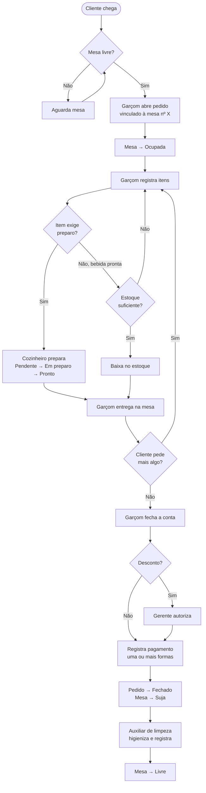
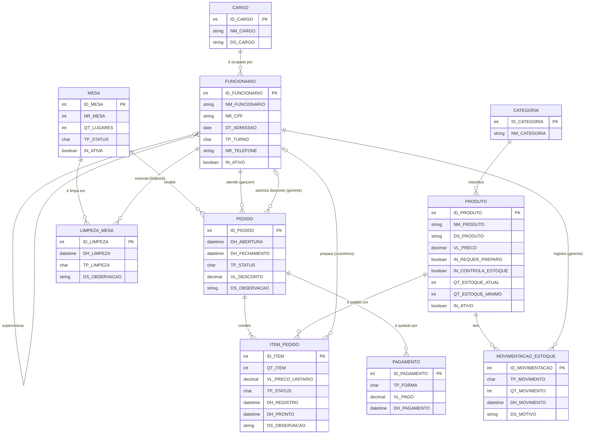

# Entrega 1 — Modelo Conceitual (DER)
### Sistema de gestão de pedidos e operação de uma lanchonete de pequeno porte

> ⚠️ **ARQUIVO DE SIMULAÇÃO / RASCUNHO.** A organização "Lanchonete Sabor da Esquina", os nomes, o endereço e os números abaixo são **fictícios** e servem de modelo. A regra da disciplina exige uma **organização real**, com pesquisa de campo. Antes de entregar: substitua tudo marcado com **`[PREENCHER]`**, valide as regras de negócio e os processos em visita à lanchonete real e **apague este aviso**.

---

## Metadados

- **Nomes dos alunos e RGM:** `[PREENCHER]` — Aluno 1 (RGM 000000), Aluno 2 (RGM 000000), Aluno 3 (RGM 000000)
- **Curso / Disciplina:** Análise e Desenvolvimento de Sistemas — Modelagem de Banco de Dados
- **Repositório:** `[PREENCHER: link do GitHub do grupo]`
- **Versão do documento:** v1.0 — 06/10/2026

---

## 1. Caracterização da Organização

- **Nome e natureza da organização:** Lanchonete Sabor da Esquina *(fictício)* — microempresa do setor de alimentação, com fins lucrativos, que vende lanches, porções, sobremesas e bebidas para consumo no local.
- **Contexto e porte:** Funciona de segunda a sábado, das 11h às 23h, com 12 mesas. A equipe tem cerca de 10 pessoas: 1 gerente, 4 garçons, 2 cozinheiros e 2 auxiliares de limpeza, em dois turnos (manhã/tarde e tarde/noite). Atende em média 80 a 120 pedidos por dia, e cada pedido é identificado pelo **número da mesa**.
- **Problemas e necessidades identificados:**
  - Os pedidos são anotados em comandas de papel, e a letra do garçom causa erros de interpretação na cozinha.
  - Não há como saber o que está pendente, em preparo ou pronto, e clientes esperam sem previsão.
  - O estoque de bebidas (refrigerantes, águas, cervejas, sucos em lata) é contado manualmente no fim da semana, e as faltas só são percebidas durante o atendimento.
  - Não há registro de quem atendeu, quem preparou e quando a mesa foi limpa, o que dificulta cobrar responsabilidades e comprovar a higienização.
  - O fechamento do caixa é feito em planilha solta, sem relação com os pedidos.
  - Descontos são concedidos sem registro de quem autorizou.
- **Justificativa da escolha:** A lanchonete reúne processos reais e variados (atendimento, produção, estoque, pagamento, limpeza) com porte adequado: tem entidades suficientes para um DER rico e é simples o bastante para ser modelada nesta etapa. Os integrantes do grupo têm acesso direto ao proprietário `[PREENCHER]`.
- **Evidências da organização:** `[PREENCHER]`
  - Fotos do local e da visita: `[anexar em /evidencias/]`
  - Link no Google Maps / rede social: `[link]`
  - Endereço completo: `[endereço]`
  - Contato do responsável: `[nome, telefone/e-mail]`
  - Datas das visitas e entrevistas: `[datas]`

---

## 2. Processos de Negócio

- **Principais processos mapeados:**

| # | Processo | Descrição resumida | Responsável principal |
|---|----------|--------------------|-----------------------|
| P1 | Abertura de pedido | O cliente se senta, o garçom registra o pedido vinculado ao número da mesa e a mesa passa a ocupada. | Garçom |
| P2 | Preparo de itens | Itens que exigem preparo vão para a cozinha, que os marca como em preparo e pronto. Bebidas prontas são entregues direto. | Cozinheiro |
| P3 | Entrega ao cliente | O garçom leva os itens prontos à mesa e marca como entregue. | Garçom |
| P4 | Fechamento e pagamento | O garçom fecha a conta, o cliente paga (inclusive em mais de uma forma) e o pedido é encerrado. A mesa passa a "suja". | Garçom / Gerente |
| P5 | Limpeza e liberação da mesa | O auxiliar de limpeza higieniza a mesa, registra a limpeza e a libera. | Auxiliar de limpeza |
| P6 | Controle de estoque de bebidas | A venda baixa o estoque. O gerente registra entradas, perdas e ajustes e acompanha o estoque mínimo. | Gerente |
| P7 | Gestão de equipe | O gerente cadastra funcionários, define cargos e turnos e supervisiona a equipe. | Gerente |

- **Fluxograma (processo-chave P1 → P5):**



---

## 3. Requisitos do Sistema

### 3.1 Requisitos Funcionais

| Código | Requisito |
|--------|-----------|
| RF01 | O sistema deve permitir cadastrar, editar e inativar funcionários, informando o cargo (garçom, cozinheiro, auxiliar de limpeza ou gerente) e o turno. |
| RF02 | O sistema deve permitir cadastrar e manter as mesas, identificadas por número e capacidade de lugares. |
| RF03 | O sistema deve exibir o status de cada mesa (livre, ocupada ou suja). |
| RF04 | O sistema deve permitir ao garçom abrir um pedido vinculado ao número da mesa. |
| RF05 | O sistema deve permitir adicionar itens a um pedido aberto, com quantidade e observação (ex.: "sem cebola"). |
| RF06 | O sistema deve permitir cadastrar produtos (lanches, porções, sobremesas e bebidas) com categoria, preço e indicação de preparo e de controle de estoque. |
| RF07 | O sistema deve enviar à cozinha os itens que exigem preparo e permitir ao cozinheiro atualizar o status (em preparo, pronto). |
| RF08 | O sistema deve permitir ao garçom marcar itens como entregues. |
| RF09 | O sistema deve permitir cancelar um item que ainda esteja pendente. |
| RF10 | O sistema deve calcular o total do pedido (soma dos itens menos o desconto). |
| RF11 | O sistema deve permitir aplicar desconto no pedido somente com a autorização de um gerente. |
| RF12 | O sistema deve registrar um ou mais pagamentos por pedido, com forma de pagamento e valor. |
| RF13 | O sistema deve fechar o pedido somente quando o total estiver quitado e todos os itens estiverem entregues ou cancelados. |
| RF14 | O sistema deve registrar a limpeza de cada mesa, informando quem limpou e quando, e só então liberar a mesa. |
| RF15 | O sistema deve baixar automaticamente o estoque das bebidas controladas a cada venda. |
| RF16 | O sistema deve permitir ao gerente registrar entradas, perdas e ajustes de estoque. |
| RF17 | O sistema deve alertar quando uma bebida atingir o estoque mínimo. |
| RF18 | O sistema deve emitir relatórios de vendas por período, por categoria, por garçom e de produtos mais vendidos. |
| RF19 | O sistema deve emitir relatório de tempo médio de preparo por cozinheiro. |

### 3.2 Requisitos Não Funcionais

| Código | Categoria | Requisito |
|--------|-----------|-----------|
| RNF01 | Desempenho | O registro de um item no pedido deve responder em até 2 segundos. |
| RNF02 | Usabilidade | A interface do garçom deve ser usável em celular ou tablet, com poucos toques por pedido. |
| RNF03 | Usabilidade | A tela da cozinha deve exibir a fila de itens em ordem de chegada, em fonte legível a distância. |
| RNF04 | Segurança | O acesso deve exigir login, com perfis por cargo (garçom, cozinheiro, limpeza, gerente). |
| RNF05 | Segurança / Privacidade | Dados pessoais dos funcionários (CPF e telefone) devem ser protegidos conforme a LGPD, com acesso restrito ao gerente. |
| RNF06 | Disponibilidade | O sistema deve estar disponível durante todo o horário de funcionamento (11h às 23h). |
| RNF07 | Integridade | Nenhum registro de pedido, pagamento ou estoque pode ser excluído fisicamente. A correção é feita por cancelamento, ajuste ou inativação. |
| RNF08 | Rastreabilidade | Toda ação relevante (item, pagamento, desconto, limpeza, estoque) deve registrar o funcionário e a data/hora. |
| RNF09 | Escalabilidade | O modelo deve permitir evoluir para novas unidades, fornecedores e cadastro de clientes sem reestruturação. |
| RNF10 | Confiabilidade | Deve haver backup diário do banco de dados. |

---

## 4. Regras de Negócio

- **Regras operacionais:**

| Código | Regra |
|--------|-------|
| RN01 | Todo pedido está vinculado a **exatamente uma mesa**, identificada pelo número. |
| RN02 | Uma mesa só pode ter **um pedido aberto por vez**. |
| RN03 | Um pedido só pode ser aberto em mesa com status **livre**. Ao abrir, a mesa passa a **ocupada**. |
| RN04 | Todo pedido tem **um garçom responsável**, e somente funcionário ativo com cargo de garçom pode ocupar esse papel. |
| RN05 | Somente funcionário ativo com cargo de cozinheiro pode ser responsável pelo preparo de um item. |
| RN06 | Produtos marcados como "requer preparo" passam pela cozinha (pendente → em preparo → pronto → entregue). Bebidas prontas vão direto de pendente para entregue. |
| RN07 | O **preço unitário é gravado no item** no momento do pedido. Reajustes futuros não alteram pedidos anteriores. |
| RN08 | Um produto com controle de estoque só pode ser adicionado ao pedido se a quantidade em estoque for **maior ou igual** à solicitada. |
| RN09 | Um item só pode ser **cancelado enquanto estiver pendente**. Após o início do preparo ele não pode mais ser cancelado. |
| RN10 | **Desconto** só pode ser aplicado com a **autorização de um gerente**, que fica registrado no pedido. O limite percentual é definido pela gerência `[PREENCHER: validar com o responsável]`. |
| RN11 | O total do pedido **não é digitado**: é calculado pela soma de (quantidade × preço unitário) dos itens não cancelados, menos o desconto. |
| RN12 | Um pedido pode ser pago com **mais de uma forma de pagamento** (ex.: parte em dinheiro e parte em Pix), e a soma dos pagamentos deve ser igual ao total. |
| RN13 | Um pedido só pode ser **fechado** se estiver integralmente pago e sem itens pendentes, em preparo ou prontos. |
| RN14 | Ao fechar o pedido, a mesa passa automaticamente a **suja**. |
| RN15 | A mesa só volta a **livre** depois do registro de uma limpeza feita por funcionário com cargo de auxiliar de limpeza. |
| RN16 | Somente o **gerente** registra movimentações de estoque (entrada, perda ou ajuste). |
| RN17 | Quando a quantidade em estoque de uma bebida for **menor ou igual ao mínimo**, o sistema deve alertar o gerente. |
| RN18 | O **CPF** do funcionário é único no sistema. |
| RN19 | Funcionários, produtos e mesas **não são excluídos**: são **inativados**, preservando o histórico. Registros inativos não podem receber novos vínculos. |
| RN20 | Todo funcionário que não seja gerente tem um **gerente supervisor**. |

- **Restrições organizacionais:**
  - **Turnos e horário de funcionamento (11h às 23h):** pedidos, limpezas e movimentações são sempre datados e o modelo precisa registrar o turno do funcionário, pois a escala define quem pode ser responsável por cada registro.
  - **Vigilância sanitária (ex.: RDC nº 216/2004 da ANVISA, boas práticas em serviços de alimentação):** a higienização precisa ser comprovável. Por isso a limpeza é uma entidade própria, com responsável e horário `[PREENCHER: confirmar com o proprietário quais normas se aplicam]`.
  - **LGPD:** CPF e telefone dos funcionários são dados pessoais. Devem ser coletados só quando necessário e com acesso restrito.
  - **Venda de bebida alcoólica:** é proibida para menores de 18 anos. A política interna é que o garçom confira o documento, e o sistema não armazena dados do cliente.
  - **Política de preços e descontos:** é definida pela gerência. Ela justifica o registro de quem autorizou cada desconto.
  - **Fora do escopo desta entrega:** emissão fiscal (NFC-e), entrega delivery, folha de pagamento, cadastro de clientes e fornecedores. Entram como evolução futura (ver seção 8).

---

## 5. Dicionário de Dados Conceitual (Preliminar)

> **Convenções:** prefixos `NM_` nome, `DT_` data, `ID_` identificador (não sofre operação matemática), `CD_` código de domínio, `QT_` quantidade, `TP_` tipo (categorização), `IN_` indicador booleano, `DS_` descrição/texto livre, `VL_` valor monetário, `NR_` número, `DH_` data e hora.
> **Notação:** `=` é composto de · `+` e · `( )` opcional · `[ | ]` escolha obrigatória · `@` identificador (chave primária).
> **SGBD de referência:** a definir na Entrega 2. Os tipos físicos abaixo são sugestões.
> **Privacidade:** todos os exemplos de valores são **fictícios**.

### CARGO
`CARGO = @ID_CARGO + NM_CARGO + DS_CARGO`

| Atributo | Tipo | Obrig. | Descrição | Regra de negócio associada |
|----------|------|--------|-----------|----------------------------|
| ID_CARGO | integer | Sim (PK) | Identificador do cargo. | — |
| NM_CARGO | varchar(30) | Sim | Nome do cargo. Valores iniciais: Garçom, Cozinheiro, Auxiliar de Limpeza, Gerente. | Único. Define o que o funcionário pode registrar (RN04, RN05, RN15, RN16). |
| DS_CARGO | varchar(150) | Não | Descrição das responsabilidades do cargo. | — |

### FUNCIONARIO
`FUNCIONARIO = @ID_FUNCIONARIO + ID_CARGO + (ID_SUPERVISOR) + NM_FUNCIONARIO + NR_CPF + DT_ADMISSAO + [TP_MANHA | TP_TARDE | TP_NOITE] + (NR_TELEFONE) + IN_ATIVO`

| Atributo | Tipo | Obrig. | Descrição | Regra de negócio associada |
|----------|------|--------|-----------|----------------------------|
| ID_FUNCIONARIO | integer | Sim (PK) | Identificador do funcionário. | — |
| ID_CARGO | integer | Sim (FK) | Cargo ocupado. | Um funcionário tem exatamente um cargo. |
| ID_SUPERVISOR | integer | Não (FK) | Gerente que supervisiona o funcionário. | Obrigatório para quem não é gerente (RN20). O gerente não tem supervisor. |
| NM_FUNCIONARIO | varchar(120) | Sim | Nome completo. Ex.: "Carlos Almeida" (fictício). | — |
| NR_CPF | char(11) | Sim | CPF, somente números. | Único (RN18). Dado pessoal, acesso restrito (LGPD). |
| DT_ADMISSAO | date | Sim | Data de admissão. | Não pode ser futura. |
| TP_TURNO | char(1) (M, T, N) | Sim | Turno de trabalho: manhã, tarde ou noite. | Domínio fechado. |
| NR_TELEFONE | varchar(15) | Não | Telefone de contato. Ex.: "(11) 90000-0000" (fictício). | Dado pessoal (LGPD). |
| IN_ATIVO | boolean | Sim | Indica se o funcionário está ativo. | Inativo não recebe novos vínculos (RN19). |

### MESA
`MESA = @ID_MESA + NR_MESA + QT_LUGARES + [TP_LIVRE | TP_OCUPADA | TP_SUJA] + IN_ATIVA`

| Atributo | Tipo | Obrig. | Descrição | Regra de negócio associada |
|----------|------|--------|-----------|----------------------------|
| ID_MESA | integer | Sim (PK) | Identificador interno da mesa. | — |
| NR_MESA | smallint | Sim | Número da mesa, visível ao cliente e ao garçom. Ex.: 7. | Único. É por ele que o pedido é identificado (RN01). |
| QT_LUGARES | smallint | Sim | Quantidade de lugares. | Maior que zero. |
| TP_STATUS | char(1) (L, O, S) | Sim | Situação atual: Livre, Ocupada ou Suja. | Muda por eventos: abertura do pedido (O), fechamento (S) e limpeza (L) (RN03, RN14, RN15). |
| IN_ATIVA | boolean | Sim | Indica se a mesa está em uso. | Mesa inativa não recebe pedidos (RN19). |

### CATEGORIA
`CATEGORIA = @ID_CATEGORIA + NM_CATEGORIA`

| Atributo | Tipo | Obrig. | Descrição | Regra de negócio associada |
|----------|------|--------|-----------|----------------------------|
| ID_CATEGORIA | integer | Sim (PK) | Identificador da categoria. | — |
| NM_CATEGORIA | varchar(40) | Sim | Nome da categoria. Ex.: Bebidas, Lanches, Porções, Sobremesas. | Único. Base para relatórios por categoria (RF18). |

### PRODUTO
`PRODUTO = @ID_PRODUTO + ID_CATEGORIA + NM_PRODUTO + (DS_PRODUTO) + VL_PRECO + IN_REQUER_PREPARO + IN_CONTROLA_ESTOQUE + (QT_ESTOQUE_ATUAL) + (QT_ESTOQUE_MINIMO) + IN_ATIVO`

| Atributo | Tipo | Obrig. | Descrição | Regra de negócio associada |
|----------|------|--------|-----------|----------------------------|
| ID_PRODUTO | integer | Sim (PK) | Identificador do produto. | — |
| ID_CATEGORIA | integer | Sim (FK) | Categoria do produto. | — |
| NM_PRODUTO | varchar(80) | Sim | Nome no cardápio. Ex.: "X-Burguer", "Refrigerante lata 350 ml". | Único dentro da categoria. |
| DS_PRODUTO | varchar(200) | Não | Descrição ou ingredientes. | — |
| VL_PRECO | decimal(8,2) | Sim | Preço de venda atual. | Maior que zero. O reajuste não altera pedidos antigos (RN07). |
| IN_REQUER_PREPARO | boolean | Sim | Se o produto passa pela cozinha. | Falso para bebidas prontas (RN06). |
| IN_CONTROLA_ESTOQUE | boolean | Sim | Se o estoque do produto é controlado. | Verdadeiro para bebidas engarrafadas e enlatadas. |
| QT_ESTOQUE_ATUAL | integer | Não | Quantidade disponível. | Obrigatório se IN_CONTROLA_ESTOQUE for verdadeiro. Não pode ser negativo (RN08). |
| QT_ESTOQUE_MINIMO | integer | Não | Quantidade que dispara o alerta de reposição. | Obrigatório se IN_CONTROLA_ESTOQUE for verdadeiro (RN17). |
| IN_ATIVO | boolean | Sim | Se o produto está no cardápio. | Inativo não pode ser pedido (RN19). |

### PEDIDO
`PEDIDO = @ID_PEDIDO + ID_MESA + ID_GARCOM + (ID_GERENTE_AUTORIZ) + DH_ABERTURA + (DH_FECHAMENTO) + [TP_ABERTO | TP_FECHADO | TP_CANCELADO] + VL_DESCONTO + (DS_OBSERVACAO)`

| Atributo | Tipo | Obrig. | Descrição | Regra de negócio associada |
|----------|------|--------|-----------|----------------------------|
| ID_PEDIDO | integer | Sim (PK) | Identificador do pedido. | — |
| ID_MESA | integer | Sim (FK) | Mesa do pedido. | Uma mesa tem no máximo um pedido aberto (RN01, RN02). |
| ID_GARCOM | integer | Sim (FK) | Funcionário (garçom) responsável. | Cargo deve ser Garçom (RN04). |
| ID_GERENTE_AUTORIZ | integer | Não (FK) | Gerente que autorizou o desconto. | Obrigatório se VL_DESCONTO for maior que zero (RN10). Cargo deve ser Gerente. |
| DH_ABERTURA | datetime | Sim | Data e hora de abertura. | Preenchida automaticamente. |
| DH_FECHAMENTO | datetime | Não | Data e hora de fechamento. | Obrigatória quando o status for Fechado (RN13). |
| TP_STATUS | char(1) (A, F, C) | Sim | Situação: Aberto, Fechado ou Cancelado. | Só passa a Fechado se estiver pago (RN13). |
| VL_DESCONTO | decimal(8,2) | Sim | Desconto em reais (padrão 0,00). | Só com autorização de gerente (RN10). Não pode exceder o total dos itens. |
| DS_OBSERVACAO | varchar(200) | Não | Observação geral do pedido. | — |

> O **total do pedido não é atributo**: é derivado (RN11).

### ITEM_PEDIDO (entidade associativa PEDIDO × PRODUTO)
`ITEM_PEDIDO = @ID_ITEM + ID_PEDIDO + ID_PRODUTO + (ID_COZINHEIRO) + QT_ITEM + VL_PRECO_UNITARIO + [TP_PENDENTE | TP_EM_PREPARO | TP_PRONTO | TP_ENTREGUE | TP_CANCELADO] + DH_REGISTRO + (DH_PRONTO) + (DS_OBSERVACAO)`

| Atributo | Tipo | Obrig. | Descrição | Regra de negócio associada |
|----------|------|--------|-----------|----------------------------|
| ID_ITEM | integer | Sim (PK) | Identificador do item. | Permite o mesmo produto em momentos diferentes do mesmo pedido. |
| ID_PEDIDO | integer | Sim (FK) | Pedido ao qual o item pertence. | Só em pedido aberto. |
| ID_PRODUTO | integer | Sim (FK) | Produto pedido. | Produto ativo (RN19). |
| ID_COZINHEIRO | integer | Não (FK) | Cozinheiro que preparou o item. | Só para produtos com preparo. Cargo deve ser Cozinheiro (RN05). |
| QT_ITEM | smallint | Sim | Quantidade pedida. | Maior que zero. Respeita o estoque disponível (RN08). |
| VL_PRECO_UNITARIO | decimal(8,2) | Sim | Preço unitário no momento do pedido. | Cópia do preço vigente (RN07). |
| TP_STATUS | char(1) (P, E, R, N, C) | Sim | Pendente, Em preparo, Pronto, Entregue ou Cancelado. | Bebida pronta vai de P para N. Só cancela se estiver pendente (RN06, RN09). |
| DH_REGISTRO | datetime | Sim | Quando o item foi lançado. | Automática. |
| DH_PRONTO | datetime | Não | Quando o item ficou pronto. | Base do tempo de preparo (RF19). |
| DS_OBSERVACAO | varchar(100) | Não | Observação do cliente. Ex.: "sem cebola". | — |

### PAGAMENTO
`PAGAMENTO = @ID_PAGAMENTO + ID_PEDIDO + [TP_DINHEIRO | TP_CREDITO | TP_DEBITO | TP_PIX] + VL_PAGO + DH_PAGAMENTO`

| Atributo | Tipo | Obrig. | Descrição | Regra de negócio associada |
|----------|------|--------|-----------|----------------------------|
| ID_PAGAMENTO | integer | Sim (PK) | Identificador do pagamento. | — |
| ID_PEDIDO | integer | Sim (FK) | Pedido quitado. | Um pedido pode ter vários pagamentos (RN12). |
| TP_FORMA | char(1) (D, C, B, P) | Sim | Forma: dinheiro, crédito, débito ou Pix. | Domínio fechado. |
| VL_PAGO | decimal(8,2) | Sim | Valor pago nesta forma. | Maior que zero. A soma deve igualar o total (RN12, RN13). |
| DH_PAGAMENTO | datetime | Sim | Data e hora do pagamento. | Automática. |

### LIMPEZA_MESA
`LIMPEZA_MESA = @ID_LIMPEZA + ID_MESA + ID_FUNCIONARIO + DH_LIMPEZA + [TP_RAPIDA | TP_GERAL] + (DS_OBSERVACAO)`

| Atributo | Tipo | Obrig. | Descrição | Regra de negócio associada |
|----------|------|--------|-----------|----------------------------|
| ID_LIMPEZA | integer | Sim (PK) | Identificador do registro de limpeza. | — |
| ID_MESA | integer | Sim (FK) | Mesa higienizada. | Libera a mesa (RN15). |
| ID_FUNCIONARIO | integer | Sim (FK) | Auxiliar de limpeza que executou. | Cargo deve ser Auxiliar de Limpeza (RN15). |
| DH_LIMPEZA | datetime | Sim | Data e hora da limpeza. | Automática. Comprova a higienização. |
| TP_LIMPEZA | char(1) (R, G) | Sim | Rápida (entre clientes) ou geral (fim de turno). | Domínio fechado. |
| DS_OBSERVACAO | varchar(150) | Não | Ocorrência. Ex.: "mesa com defeito". | — |

### MOVIMENTACAO_ESTOQUE
`MOVIMENTACAO_ESTOQUE = @ID_MOVIMENTACAO + ID_PRODUTO + ID_GERENTE + [TP_ENTRADA | TP_PERDA | TP_AJUSTE] + QT_MOVIMENTO + DH_MOVIMENTO + (DS_MOTIVO)`

| Atributo | Tipo | Obrig. | Descrição | Regra de negócio associada |
|----------|------|--------|-----------|----------------------------|
| ID_MOVIMENTACAO | integer | Sim (PK) | Identificador da movimentação. | — |
| ID_PRODUTO | integer | Sim (FK) | Produto movimentado. | Só produtos com controle de estoque. |
| ID_GERENTE | integer | Sim (FK) | Gerente que registrou. | Cargo deve ser Gerente (RN16). |
| TP_MOVIMENTO | char(1) (E, P, A) | Sim | Entrada, Perda (quebra, validade) ou Ajuste (inventário). | Domínio fechado. |
| QT_MOVIMENTO | integer | Sim | Quantidade movimentada. | Maior que zero. |
| DH_MOVIMENTO | datetime | Sim | Data e hora do registro. | Automática. |
| DS_MOTIVO | varchar(150) | Não | Justificativa. Ex.: "3 garrafas quebradas". | Recomendado para Perda e Ajuste. |

---

## 6. Modelagem Conceitual (Entidades, Atributos, Relacionamentos)

- **Entidades reconhecidas:**

| Entidade | Justificativa |
|----------|---------------|
| CARGO | Agrupa as funções (garçom, cozinheiro, limpeza, gerente) e define permissões, evitando repetir texto em cada funcionário. |
| FUNCIONARIO | Representa todas as pessoas da equipe, que atuam em processos diferentes mas compartilham os mesmos dados cadastrais. |
| MESA | A mesa é a identificação do pedido no dia a dia da lanchonete e tem estado próprio (livre, ocupada ou suja). |
| CATEGORIA | Organiza o cardápio (bebidas, lanches etc.) e sustenta os relatórios por categoria. |
| PRODUTO | Itens vendáveis, tanto preparados quanto bebidas. |
| PEDIDO | Registro central da operação: o atendimento de uma mesa por um garçom. |
| ITEM_PEDIDO | Entidade associativa que resolve o N:N entre PEDIDO e PRODUTO e guarda dados próprios (quantidade, preço, status, cozinheiro). |
| PAGAMENTO | Permite pagamento dividido em várias formas para o mesmo pedido. |
| LIMPEZA_MESA | Documenta quem limpou, qual mesa e quando, e atende a exigência de higienização. |
| MOVIMENTACAO_ESTOQUE | Histórico de entradas, perdas e ajustes das bebidas, com o gerente responsável. |

- **Atributos e classificações:** Os atributos de cada entidade estão no dicionário (seção 5). Classificação dos principais:
  - **Identificadores:** todos os `ID_*`.
  - **Obrigatórios × opcionais:** opcionais entre parênteses (ex.: `ID_SUPERVISOR`, `ID_COZINHEIRO`, `DH_FECHAMENTO`).
  - **Domínio fechado:** `TP_STATUS` (mesa, pedido, item), `TP_FORMA`, `TP_TURNO`, `TP_MOVIMENTO`, `TP_LIMPEZA`.
  - **Derivados (não armazenados):** total do pedido, valor total pago e tempo de preparo.
  - **Monetários:** `VL_PRECO`, `VL_PRECO_UNITARIO`, `VL_DESCONTO`, `VL_PAGO`.

- **Relacionamentos pertinentes:**

| Entidade A | Relacionamento | Entidade B | Cardinalidade | Leitura |
|------------|----------------|------------|---------------|---------|
| CARGO | é ocupado por | FUNCIONARIO | 1:N | Um cargo tem vários funcionários. Cada funcionário tem exatamente um cargo. |
| FUNCIONARIO (gerente) | supervisiona | FUNCIONARIO | 1:N (autorrelacionamento) | Um gerente supervisiona vários funcionários. Cada funcionário tem no máximo um supervisor. |
| MESA | recebe | PEDIDO | 1:N | Uma mesa recebe vários pedidos ao longo do tempo. Cada pedido pertence a uma única mesa. |
| FUNCIONARIO (garçom) | atende | PEDIDO | 1:N | Um garçom atende vários pedidos. Cada pedido tem um garçom responsável. |
| FUNCIONARIO (gerente) | autoriza desconto em | PEDIDO | 1:N opcional | Um gerente autoriza vários descontos. Um pedido tem zero ou um gerente autorizador. |
| PEDIDO | contém | ITEM_PEDIDO | 1:N | Um pedido tem um ou mais itens. Cada item pertence a um único pedido. |
| PRODUTO | é pedido em | ITEM_PEDIDO | 1:N | Um produto aparece em vários itens. Cada item refere-se a um produto. |
| PEDIDO × PRODUTO | (via ITEM_PEDIDO) | — | N:N | Um pedido tem vários produtos e um produto está em vários pedidos. |
| FUNCIONARIO (cozinheiro) | prepara | ITEM_PEDIDO | 1:N opcional | Um cozinheiro prepara vários itens. Um item tem zero ou um cozinheiro (bebidas prontas não têm). |
| CATEGORIA | classifica | PRODUTO | 1:N | Uma categoria agrupa vários produtos. Cada produto tem uma categoria. |
| PEDIDO | é quitado por | PAGAMENTO | 1:N | Um pedido tem zero (aberto) ou vários pagamentos. Cada pagamento pertence a um pedido. |
| MESA | é limpa em | LIMPEZA_MESA | 1:N | Uma mesa tem várias limpezas. Cada limpeza é de uma mesa. |
| FUNCIONARIO (limpeza) | executa | LIMPEZA_MESA | 1:N | Um auxiliar executa várias limpezas. Cada limpeza é feita por um auxiliar. |
| PRODUTO | tem | MOVIMENTACAO_ESTOQUE | 1:N | Um produto tem várias movimentações. Cada movimentação é de um produto. |
| FUNCIONARIO (gerente) | registra | MOVIMENTACAO_ESTOQUE | 1:N | Um gerente registra várias movimentações. Cada movimentação tem um gerente responsável. |

- **Restrições e políticas organizacionais aplicadas ao modelo:**
  - O papel do funcionário em cada relacionamento (garçom, cozinheiro, limpeza, gerente) é verificado pelo **cargo** (RN04, RN05, RN15, RN16).
  - Nenhum registro histórico é excluído, apenas inativado (RN19). Por isso há `IN_ATIVO`/`IN_ATIVA` e status em vez de exclusão.
  - O preço é copiado para o item (RN07), e o total é derivado (RN11).
  - O desconto exige autorização rastreável (RN10).

---

## 7. Diagrama Entidade-Relacionamento (DER)

> O GitHub renderiza o diagrama abaixo (Mermaid). **Exporte também o DER em imagem (PNG)** — por exemplo, no BrModelo ou no DBDesigner — e anexe em `/docs/DER_lanchonete.png`, como exige a disciplina. No diagrama conceitual, as chaves estrangeiras não aparecem: elas surgem dos relacionamentos na Entrega 2.




**Legenda das cardinalidades:** `||` exatamente um · `|o` zero ou um · `o{` zero ou muitos · `|{` um ou muitos.

---

## 8. Justificativa Técnica

**Por que essas entidades?**
- **FUNCIONARIO único + CARGO** em vez de quatro entidades (Garçom, Cozinheiro, Limpeza, Gerente): os quatro compartilham quase todos os dados (nome, CPF, admissão, turno). Quatro tabelas repetiriam estrutura e dificultariam relatórios gerais. Separar o cargo em entidade evita texto repetido, permite criar novos cargos sem alterar o modelo e deixa as regras de papel (RN04, RN05, RN15, RN16) verificáveis por consulta. A alternativa de generalização/especialização seria justificada se cada cargo tivesse atributos próprios relevantes, o que não foi observado.
- **MESA como entidade** (e não só um número no pedido): a mesa tem estado próprio (livre, ocupada ou suja), capacidade e histórico de limpezas. Tratá-la como atributo impediria controlar a rotatividade e o fluxo de higienização.
- **ITEM_PEDIDO como entidade associativa:** o N:N entre PEDIDO e PRODUTO carrega dados que pertencem à *relação* e não a cada lado: quantidade, preço praticado, status de preparo, cozinheiro e observação do cliente. Foi usada chave própria (`ID_ITEM`) em vez de chave composta (pedido + produto) porque o mesmo produto pode ser pedido em momentos diferentes do mesmo pedido (ex.: segunda rodada de refrigerante) com status distintos.
- **PAGAMENTO separado do PEDIDO:** a observação de campo indica que clientes dividem a conta em formas diferentes. Um atributo "forma de pagamento" no pedido não suportaria isso. Como entidade, também prepara o caminho para conciliação de caixa.
- **LIMPEZA_MESA como entidade:** transforma uma tarefa informal em evidência rastreável (quem, qual mesa, quando), o que atende a necessidade sanitária e libera a mesa por um evento real. O atributo derivado da mesa não teria histórico.
- **MOVIMENTACAO_ESTOQUE:** guarda o histórico (entradas, perdas, ajustes) com responsável. O saldo atual (`QT_ESTOQUE_ATUAL`) é um atributo de conveniência para consulta rápida e para a regra RN08. Reconhecemos que é **derivado** das movimentações e das vendas, e na Entrega 2 avaliaremos se ele permanece (mantido por gatilho) ou se passa a ser calculado.

**Por que um único PRODUTO para pratos e bebidas?** Pratos e bebidas têm os mesmos dados essenciais (nome, categoria, preço) e entram no pedido do mesmo jeito. As diferenças foram tratadas por dois indicadores (`IN_REQUER_PREPARO` e `IN_CONTROLA_ESTOQUE`) e pelos atributos opcionais de estoque. Uma entidade BEBIDA separada duplicaria o relacionamento com ITEM_PEDIDO. O custo é ter atributos opcionais, que aceitamos pela simplicidade.

**Por que essas cardinalidades?**
- O pedido ligado a **uma** mesa e a **um** garçom reflete o processo real e permite relatórios por garçom. Se o atendimento passasse a ser compartilhado por vários garçons, esse relacionamento viraria N:N.
- O **autorrelacionamento** de FUNCIONARIO (supervisor) modela a hierarquia sem uma entidade extra. Como só há dois níveis hoje, ele é simples e suficiente.
- Os papéis opcionais (`gerente autorizador` no pedido e `cozinheiro` no item) são opcionais porque nem todo pedido tem desconto e nem toda bebida passa pela cozinha. O banco não deve forçar dados que não existem.

**Decisões de abstração:**
- **Total do pedido não é armazenado:** é derivado de itens e desconto (RN11), o que evita inconsistência entre total e itens.
- **Preço copiado para o item:** sem isso, reajustar o cardápio alteraria vendas antigas e distorceria relatórios (RN07).
- **Inativação em vez de exclusão:** preserva a integridade histórica (RN19, RNF07).

**Escalabilidade e integração (próximas etapas):** o modelo comporta, sem reestruturação, a inclusão de **FORNECEDOR** (ligado às entradas de estoque), **CLIENTE** e fidelidade (ligado ao pedido), **FILIAL** (nova entidade pai de mesas, funcionários e pedidos), **delivery/comanda online** (novo tipo de pedido sem mesa), **ficha técnica** (insumos por produto) e **nota fiscal**. A estrutura de pedido, item e pagamento também sustenta indicadores de BI, como ticket médio, produtos mais vendidos, giro de mesas, tempo de preparo e perdas de estoque.

---

## 9. Uso de Inteligência Artificial

> ⚠️ **Preencha com a realidade do grupo.** A disciplina exige o registro honesto de cada uso de IA. O texto abaixo é um **ponto de partida** com o que consta na geração deste rascunho. Os campos marcados `[PREENCHER]` só o grupo pode responder (o que foi verificado, rejeitado ou corrigido).

| Item | Registro |
|------|----------|
| **Ferramenta e etapa** | Claude (Anthropic) — elaboração de um rascunho completo do README da Entrega 1 (processos, requisitos, regras de negócio, dicionário de dados, relacionamentos, DER em Mermaid e justificativa). |
| **Motivação** | `[PREENCHER]` Ex.: ter um modelo de referência de como preencher cada seção do esqueleto antes de levar o conteúdo para a organização real. |
| **Prompt(s) utilizados** | "faça uma simulação da entrega 1, pega uma lanchonete, que tenha bebidas, pedidos é marcado por numeração de mesa, tenha garçons, cozinheiro, limpeza, gerente e estruture tudo para a entrega 1" (anexado o esqueleto `00-c_Esqueleto_Entrega_1.md` e o exemplo `02-03g_Exemplo_Dicionario_Dados.pdf`). |
| **Resposta recebida** | Rascunho completo com 10 entidades, 20 regras de negócio, 19 requisitos funcionais, 10 não funcionais, dicionário de dados e DER em Mermaid. |
| **Fontes consultadas e verificadas** | `[PREENCHER]` A IA não consultou a organização real. Tudo o que descreve a operação da lanchonete (horários, número de mesas, equipe, volume, problemas, normas sanitárias aplicáveis) precisa ser verificado em campo. A citação da RDC nº 216/2004 da ANVISA deve ser conferida na fonte oficial. |
| **Trechos rejeitados ou corrigidos** | `[PREENCHER]` Ex.: regras que não existem na lanchonete real, atributos desnecessários, limite de desconto. |
| **Justificativa da escolha final** | `[PREENCHER]` |
| **Reflexão crítica** | `[PREENCHER]` Pontos de atenção: a IA inventou um cenário genérico de lanchonete (generalização); os números e dados do contexto são fictícios; o atributo `QT_ESTOQUE_ATUAL` é derivado e pode ser questionado na normalização; o modelo precisa ser validado com quem opera o negócio. |

---

## Critérios Atitudinais (20%)

Avaliados por Avaliação 360º entre os integrantes e pelo histórico de commits equilibrado do repositório. Não constam como item de entrega neste README.

---

## Estrutura sugerida do repositório

```
/
├── README.md                      ← este arquivo (Entrega 1)
├── docs/
│   ├── DER_lanchonete.png         ← DER em imagem
│   └── dicionario_dados.html      ← dicionário de dados em HTML
└── evidencias/
    └── (fotos da visita, prints do Google Maps etc.)
```
