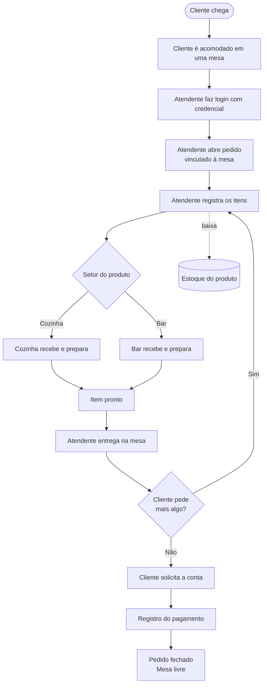
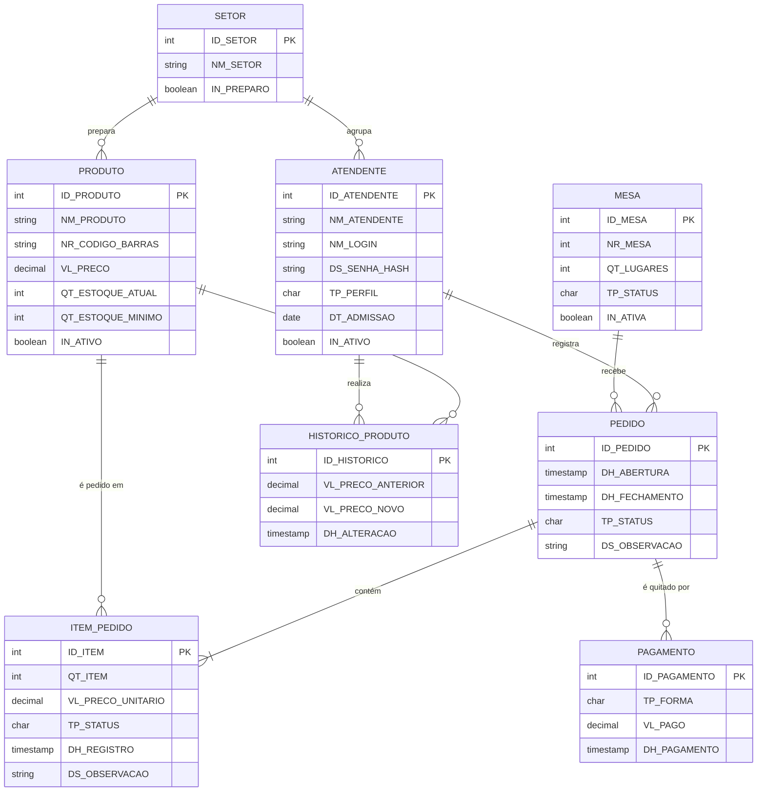

# 🍽️ Projeto: Palazio del Chef
### Entrega 1 — Modelo Conceitual (DER)

<p align="center">
  
  
</p>

> **Como ler os marcadores deste arquivo** *(apague este bloco antes de entregar)*
> - **`[VALIDAR]`** — informação que veio da proposta de organização do texto e precisa ser confirmada com o grupo ou no estabelecimento.
> - **`[PREENCHER]`** — dado que só o grupo tem (RGM, endereço, contato etc.).
> - **`(proposta)`** — regra, requisito ou entidade **nova**, que não estava no README original. O grupo decide se mantém ou remove.
> - Itens marcados **`(original)`** vieram do README anterior do grupo.

---

## 👥 Metadados

| Integrante | RGM |
|------------|-----|
| Victor Anjos | `[PREENCHER]` |
| Thiago Rodrigues | `[PREENCHER]` |
| Ricardo Santos | `[PREENCHER]` |
| Raphael Luiz | `[PREENCHER]` |

- **Curso / Disciplina:** Análise e Desenvolvimento de Sistemas — Modelagem de Banco de Dados (UNICID)
- **Versão do documento:** v1.0 — 06/10/2026

---

## 1. 📖 Caracterização da Organização

- **Nome e natureza:** **Palazio del Chef** — estabelecimento do segmento de alimentação, com características de **restaurante e bar**, com fins lucrativos.
- **Contexto e porte:** Médio porte, com fluxo considerável de clientes. A operação é dividida entre salão (atendimento), cozinha e bar. `[PREENCHER: nº de mesas, nº de funcionários por setor, horário de funcionamento, média de pedidos por dia]`
- **Problemas e necessidades identificados:**
  - **Falta de controle dos atendentes (original):** a equipe não é registrada por credenciais. Isso dificulta saber quem registrou cada pedido e controlar as atividades feitas no sistema.
  - `[VALIDAR]` Outros problemas observados em campo: a comunicação do pedido com cozinha e bar, o controle do estoque e a conferência dos pagamentos.
- **Justificativa da escolha:** O estabelecimento foi escolhido pela sua estrutura operacional e pelos processos envolvidos no funcionamento (atendimento, produção em setores distintos, estoque e pagamento), o que permite aplicar os conceitos de modelagem de banco de dados. O grupo tem acesso ao local para a pesquisa de campo. `[PREENCHER: como o grupo tem acesso — ex.: vínculo com o proprietário]`
- **Evidências da organização:**

<p align="center">
  
</p>

  - Endereço completo: `[PREENCHER]`
  - Link no Google Maps / rede social: `[PREENCHER]`
  - Responsável e forma de contato: `[PREENCHER: nome, telefone/e-mail]`
  - Datas das visitas e entrevistas: `[PREENCHER]`

### 🎯 Objetivo do Projeto (original)

Analisar os processos do estabelecimento e desenvolver uma modelagem de banco de dados capaz de organizar as principais informações relacionadas ao **atendimento, pedidos, produtos, mesas, setores e atendentes**.

---

## 2. 🗺️ Processos de Negócio

- **Principais processos mapeados (original):**

| # | Processo | Descrição resumida | Responsável |
|---|----------|--------------------|-------------|
| P1 | 🛎️ Atendimento ao cliente | O cliente chega, é acomodado em uma mesa e atendido. | Atendente `[VALIDAR]` |
| P2 | 📝 Registro do pedido | O atendente, identificado por credencial, registra os itens vinculados à mesa. | Atendente |
| P3 | 🏃 Encaminhamento para cozinha/bar | Cada item vai para o setor responsável pelo preparo (cozinha ou bar). | Sistema / Atendente `[VALIDAR]` |
| P4 | 🍳 Preparação do pedido | O setor prepara o item e o marca como pronto. | Cozinha / Bar |
| P5 | 💳 Pagamento | O cliente solicita a conta e paga, com uma ou mais formas. | Atendente / Caixa `[VALIDAR]` |
| P6 | 📦 Controle de estoque | A venda e as reposições alteram a quantidade disponível dos produtos. | Gerência `[VALIDAR]` |
| P7 | 🧑‍🍳 Cadastro e controle de atendentes | Cada funcionário é cadastrado com credencial e perfil de acesso. | Gerência `[VALIDAR]` |

- **Fluxograma** *(rascunho em Mermaid; o grupo também desenvolve a versão em imagem em `Fluxograma_Palazio_del_Chef/`)*:



---

## 3. ⚙️ Requisitos do Sistema

### 3.1 Requisitos Funcionais

| Código | Requisito | Origem |
|--------|-----------|--------|
| RF01 | O sistema deve permitir que o atendente registre um pedido de forma eficiente. | original |
| RF02 | O sistema deve cadastrar atendentes com credenciais individuais (login e senha) e perfil de acesso. | proposta (resolve o problema identificado) |
| RF03 | O sistema deve exigir autenticação do atendente antes de registrar ou alterar um pedido. | proposta |
| RF04 | O sistema deve vincular cada pedido a uma mesa e ao atendente que o registrou. | proposta (formaliza as regras originais) |
| RF05 | O sistema deve permitir adicionar itens a um pedido aberto, com quantidade e observação. | proposta |
| RF06 | O sistema deve encaminhar cada item ao setor responsável pelo preparo (cozinha ou bar). | proposta |
| RF07 | O sistema deve permitir que cozinha e bar atualizem o status dos itens (em preparo, pronto). | proposta |
| RF08 | O sistema deve cadastrar produtos com código de barras, preço, setor e estoque. | proposta |
| RF09 | O sistema deve atualizar o estoque a cada venda e alertar quando atingir o mínimo. | proposta |
| RF10 | O sistema deve registrar o histórico de alterações de preço dos produtos. | proposta |
| RF11 | O sistema deve calcular o total do pedido e registrar um ou mais pagamentos. | proposta |
| RF12 | O sistema deve fechar o pedido somente após o pagamento integral e liberar a mesa. | proposta |
| RF13 | O sistema deve emitir relatórios de vendas por período, por atendente e por produto. | proposta |

### 3.2 Requisitos Não Funcionais

| Código | Categoria | Requisito | Origem |
|--------|-----------|-----------|--------|
| RNF01 | Segurança | O sistema deve garantir que somente funcionários autorizados visualizem informações restritas do bar ou da cozinha. | original |
| RNF02 | Segurança | O sistema deve possuir controle de acesso, garantindo segurança e confidencialidade conforme o nível de permissão de cada usuário. | original |
| RNF03 | Segurança | As senhas devem ser armazenadas de forma criptografada (hash), nunca em texto puro. | proposta |
| RNF04 | Rastreabilidade | Toda ação relevante (pedido, item, pagamento, alteração de preço) deve registrar o atendente e a data/hora. | proposta |
| RNF05 | Integridade | Pedidos, itens e pagamentos não podem ser excluídos fisicamente; a correção é feita por cancelamento ou inativação. | proposta |
| RNF06 | Usabilidade | O registro de pedidos deve ser rápido e usável em dispositivo móvel no salão. | proposta |
| RNF07 | Disponibilidade | O sistema deve estar disponível em todo o horário de funcionamento. | proposta |

---

## 4. 📜 Regras de Negócio

- **Regras operacionais:**

| Código | Regra | Origem |
|--------|-------|--------|
| RN01 | **Rastreabilidade de pedidos:** todo pedido deve estar obrigatoriamente associado a um atendente responsável pelo seu registro. | original |
| RN02 | **Localização do cliente:** todo pedido deve estar vinculado a uma mesa. Não pode existir pedido sem número de mesa. | original |
| RN03 | **Identificação de produtos:** todo produto cadastrado deve possuir um código de barras, único no sistema. `[VALIDAR: pratos preparados na cozinha também têm código de barras? Se não, a regra vale só para produtos de revenda.]` | original |
| RN04 | Somente atendente **ativo e autenticado** pode registrar pedidos. | proposta |
| RN05 | Uma mesa só pode ter **um pedido aberto por vez**. | proposta |
| RN06 | Cada item é encaminhado ao **setor de preparo do produto** (cozinha ou bar). | proposta |
| RN07 | O **preço unitário é gravado no item** no momento do pedido. Reajustes não alteram pedidos anteriores. | proposta |
| RN08 | Um item só pode ser adicionado se houver **estoque suficiente** do produto. `[VALIDAR]` | proposta |
| RN09 | Um item só pode ser **cancelado enquanto estiver pendente**. | proposta |
| RN10 | O pedido só pode ser **fechado** se estiver integralmente pago e sem itens pendentes ou em preparo. | proposta |
| RN11 | O **total do pedido é calculado** (não é digitado): soma de quantidade × preço unitário dos itens não cancelados. | proposta |
| RN12 | **Login único** por atendente. Cada atendente pertence a **um setor** e tem **um perfil** de acesso. | proposta |
| RN13 | Atendentes, produtos e mesas **não são excluídos**, apenas inativados, preservando o histórico. | proposta |

- **Restrições organizacionais:**
  - **Controle de acesso por setor e perfil (original):** informações do bar e da cozinha são restritas aos funcionários autorizados. Por isso o atendente tem setor e perfil no modelo.
  - **LGPD:** os dados de funcionários devem ser mínimos (por isso o modelo não guarda CPF nem telefone) e o acesso a eles é restrito.
  - **Venda de bebida alcoólica:** proibida para menores de 18 anos. É política de atendimento, sem dados de cliente no sistema. `[VALIDAR]`
  - **Fora do escopo desta entrega:** emissão fiscal, delivery, cadastro de clientes e fornecedores, folha de pagamento.

---

## 5. 🗄️ Dicionário de Dados Conceitual (Preliminar)

> **Convenções:** prefixos `NM_` nome, `DT_` data, `ID_` identificador (não sofre operação matemática), `QT_` quantidade, `TP_` tipo (categorização), `IN_` indicador booleano, `DS_` descrição/texto livre, `VL_` valor monetário, `NR_` número, `DH_` data e hora.
> **Notação:** `=` é composto de · `+` e · `( )` opcional · `[ | ]` escolha obrigatória · `@` identificador (chave primária).
> **Tipos:** `Integer`, `Varchar`, `Date`, `Decimal` e `Timestamp`/`Boolean`, como no README original. **SGBD de referência:** PostgreSQL.
> **Privacidade:** todos os exemplos de valores são **fictícios**.
> O mapeamento foi estruturado com base nos parâmetros do portal *Datapsico* e no modelo da disciplina (arquivo 02-03g). O dicionário completo está em [./dicionario_dados_palazio/index.html](./dicionario_dados_palazio/index.html).
> `[VALIDAR]` Os atributos abaixo são uma proposta. **Confira com o dicionário e o DER que o grupo já fez** e ajuste o que divergir.

### SETOR
`SETOR = @ID_SETOR + NM_SETOR + IN_PREPARO`

| Atributo | Tipo | Obrig. | Descrição | Regra de negócio associada |
|----------|------|--------|-----------|----------------------------|
| ID_SETOR | integer | Sim (PK) | Identificador do setor. | — |
| NM_SETOR | varchar(30) | Sim | Nome do setor. Ex.: Salão, Cozinha, Bar. | Único. |
| IN_PREPARO | boolean | Sim | Indica se o setor prepara produtos. | Verdadeiro para Cozinha e Bar. Só esses setores podem ser setor de preparo de um produto (RN06). |

### ATENDENTE
`ATENDENTE = @ID_ATENDENTE + ID_SETOR + NM_ATENDENTE + NM_LOGIN + DS_SENHA_HASH + TP_PERFIL + DT_ADMISSAO + IN_ATIVO`

| Atributo | Tipo | Obrig. | Descrição | Regra de negócio associada |
|----------|------|--------|-----------|----------------------------|
| ID_ATENDENTE | integer | Sim (PK) | Identifica individualmente cada atendente que registra pedidos. | Base da rastreabilidade (RN01). |
| ID_SETOR | integer | Sim (FK) | Setor em que o funcionário atua. | Define quais informações ele visualiza (RNF01). |
| NM_ATENDENTE | varchar(120) | Sim | Nome completo. Ex.: "Mariana Costa" (fictício). | — |
| NM_LOGIN | varchar(30) | Sim | Credencial de acesso. Ex.: "mariana.costa". | Único (RN12). |
| DS_SENHA_HASH | varchar(255) | Sim | Senha armazenada em hash. | Nunca em texto puro (RNF03). |
| TP_PERFIL | char(1) (A, P, G) | Sim | Perfil de acesso: Atendimento, Preparo (cozinha/bar) ou Gerência. | Define as permissões (RNF02). |
| DT_ADMISSAO | date | Sim | Data de admissão. | Não pode ser futura. |
| IN_ATIVO | boolean | Sim | Se o funcionário está ativo. | Inativo não registra pedidos e mantém o histórico (RN04, RN13). |

### MESA
`MESA = @ID_MESA + NR_MESA + QT_LUGARES + TP_STATUS + IN_ATIVA`

| Atributo | Tipo | Obrig. | Descrição | Regra de negócio associada |
|----------|------|--------|-----------|----------------------------|
| ID_MESA | integer | Sim (PK) | Identificador interno da mesa. | — |
| NR_MESA | smallint | Sim | Número da mesa, usado pelo atendente. Ex.: 12. | Único (RN02). |
| QT_LUGARES | smallint | Sim | Quantidade de lugares. | Maior que zero. |
| TP_STATUS | char(1) (L, O) | Sim | Situação: Livre ou Ocupada. | Ocupada ao abrir o pedido, livre ao fechar (RN05, RN10). |
| IN_ATIVA | boolean | Sim | Se a mesa está em uso. | Mesa inativa não recebe pedidos (RN13). |

### PRODUTO
`PRODUTO = @ID_PRODUTO + ID_SETOR + NM_PRODUTO + NR_CODIGO_BARRAS + VL_PRECO + QT_ESTOQUE_ATUAL + QT_ESTOQUE_MINIMO + IN_ATIVO`

| Atributo | Tipo | Obrig. | Descrição | Regra de negócio associada |
|----------|------|--------|-----------|----------------------------|
| ID_PRODUTO | integer | Sim (PK) | Identificador do produto. | — |
| ID_SETOR | integer | Sim (FK) | Setor responsável pelo preparo (Cozinha ou Bar). | Setor com IN_PREPARO verdadeiro (RN06). |
| NM_PRODUTO | varchar(80) | Sim | Nome no cardápio. Ex.: "Risoto de funghi", "Chope 300 ml". | — |
| NR_CODIGO_BARRAS | varchar(14) | Sim | Código de barras. | Único (RN03). `[VALIDAR]` |
| VL_PRECO | decimal(8,2) | Sim | Preço de venda atual. | Maior que zero. Reajuste não altera pedidos antigos (RN07). |
| QT_ESTOQUE_ATUAL | integer | Sim | Quantidade disponível. | Não pode ser negativa (RN08). `[VALIDAR]` |
| QT_ESTOQUE_MINIMO | integer | Sim | Quantidade que dispara o alerta de reposição. | Alerta de reposição (RF09). |
| IN_ATIVO | boolean | Sim | Se o produto está no cardápio. | Inativo não pode ser pedido (RN13). |

### HISTORICO_PRODUTO *(proposta de definição — o README original só citava o nome)*
`HISTORICO_PRODUTO = @ID_HISTORICO + ID_PRODUTO + ID_ATENDENTE + VL_PRECO_ANTERIOR + VL_PRECO_NOVO + DH_ALTERACAO`

| Atributo | Tipo | Obrig. | Descrição | Regra de negócio associada |
|----------|------|--------|-----------|----------------------------|
| ID_HISTORICO | integer | Sim (PK) | Identificador do registro. | — |
| ID_PRODUTO | integer | Sim (FK) | Produto alterado. | — |
| ID_ATENDENTE | integer | Sim (FK) | Quem fez a alteração. | Perfil de Gerência (RNF04). |
| VL_PRECO_ANTERIOR | decimal(8,2) | Sim | Preço antes da alteração. | — |
| VL_PRECO_NOVO | decimal(8,2) | Sim | Preço depois da alteração. | Maior que zero. |
| DH_ALTERACAO | timestamp | Sim | Data e hora da alteração. | Automática. |

### PEDIDO
`PEDIDO = @ID_PEDIDO + ID_MESA + ID_ATENDENTE + DH_ABERTURA + (DH_FECHAMENTO) + TP_STATUS + (DS_OBSERVACAO)`

| Atributo | Tipo | Obrig. | Descrição | Regra de negócio associada |
|----------|------|--------|-----------|----------------------------|
| ID_PEDIDO | integer | Sim (PK) | Identificador do pedido. | — |
| ID_MESA | integer | Sim (FK) | Mesa do pedido. | Obrigatório: não existe pedido sem mesa (RN02). Uma mesa tem no máximo um pedido aberto (RN05). |
| ID_ATENDENTE | integer | Sim (FK) | Atendente que registrou o pedido. | Obrigatório e ativo (RN01, RN04). |
| DH_ABERTURA | timestamp | Sim | Data e hora de abertura. | Automática. |
| DH_FECHAMENTO | timestamp | Não | Data e hora de fechamento. | Obrigatória quando o status for Fechado (RN10). |
| TP_STATUS | char(1) (A, F, C) | Sim | Aberto, Fechado ou Cancelado. | Fecha só se estiver pago (RN10). |
| DS_OBSERVACAO | varchar(200) | Não | Observação geral. | — |

> O **total do pedido não é atributo**: é derivado (RN11).

### ITEM_PEDIDO *(entidade associativa PEDIDO × PRODUTO)*
`ITEM_PEDIDO = @ID_ITEM + ID_PEDIDO + ID_PRODUTO + QT_ITEM + VL_PRECO_UNITARIO + TP_STATUS + DH_REGISTRO + (DS_OBSERVACAO)`

| Atributo | Tipo | Obrig. | Descrição | Regra de negócio associada |
|----------|------|--------|-----------|----------------------------|
| ID_ITEM | integer | Sim (PK) | Identificador do item. | Permite o mesmo produto em momentos diferentes do pedido. |
| ID_PEDIDO | integer | Sim (FK) | Pedido ao qual pertence. | Só em pedido aberto. |
| ID_PRODUTO | integer | Sim (FK) | Produto pedido. | Produto ativo e com estoque (RN08, RN13). |
| QT_ITEM | smallint | Sim | Quantidade pedida. | Maior que zero. |
| VL_PRECO_UNITARIO | decimal(8,2) | Sim | Preço unitário no momento do pedido. | Cópia do preço vigente (RN07). |
| TP_STATUS | char(1) (P, E, R, N, C) | Sim | Pendente, Em preparo, Pronto, Entregue ou Cancelado. | Cancela só se pendente (RN09). O setor do produto determina quem atualiza (RN06). |
| DH_REGISTRO | timestamp | Sim | Quando o item foi lançado. | Automática. |
| DS_OBSERVACAO | varchar(100) | Não | Observação do cliente. Ex.: "sem gelo". | — |

### PAGAMENTO *(proposta — o processo "Pagamento" não tinha entidade)*
`PAGAMENTO = @ID_PAGAMENTO + ID_PEDIDO + TP_FORMA + VL_PAGO + DH_PAGAMENTO`

| Atributo | Tipo | Obrig. | Descrição | Regra de negócio associada |
|----------|------|--------|-----------|----------------------------|
| ID_PAGAMENTO | integer | Sim (PK) | Identificador do pagamento. | — |
| ID_PEDIDO | integer | Sim (FK) | Pedido quitado. | Um pedido pode ter vários pagamentos. |
| TP_FORMA | char(1) (D, C, B, P) | Sim | Dinheiro, crédito, débito ou Pix. | Domínio fechado. |
| VL_PAGO | decimal(8,2) | Sim | Valor pago nesta forma. | A soma deve igualar o total (RN10, RN11). |
| DH_PAGAMENTO | timestamp | Sim | Data e hora do pagamento. | Automática. |

---

## 6. 🧠 Modelagem Conceitual (Entidades, Atributos, Relacionamentos)

- **Entidades reconhecidas:**

| Entidade | Justificativa | Origem |
|----------|---------------|--------|
| ATENDENTE | Funcionário com credencial individual, que resolve o problema identificado de controle e rastreabilidade. | original |
| MESA | Identifica o local do cliente e é o vínculo obrigatório do pedido. | original |
| PEDIDO | Registro central do atendimento. | original |
| ITEM_PEDIDO | Resolve o N:N entre pedido e produto e guarda quantidade, preço e status de preparo. | original |
| PRODUTO | Itens vendidos, com código de barras e estoque. | original |
| SETOR | Define salão, cozinha e bar, tanto para a lotação do funcionário quanto para o encaminhamento do preparo. | original |
| HISTORICO_PRODUTO | Histórico de alterações de preço dos produtos. | original (nome) / proposta (definição) |
| PAGAMENTO | Registra o pagamento, que é um dos processos mapeados. | proposta |

- **Atributos e classificações:** detalhados no dicionário (seção 5). Identificadores `ID_*`. Opcionais entre parênteses. Domínios fechados em `TP_*`. **Derivado (não armazenado):** total do pedido.

- **Relacionamentos pertinentes:**

| Entidade A | Relacionamento | Entidade B | Cardinalidade | Leitura |
|------------|----------------|------------|---------------|---------|
| SETOR | agrupa | ATENDENTE | 1:N | Um setor tem vários funcionários. Cada funcionário atua em um setor. |
| SETOR | prepara | PRODUTO | 1:N | Um setor (cozinha ou bar) prepara vários produtos. Cada produto tem um setor de preparo. |
| ATENDENTE | registra | PEDIDO | 1:N | Um atendente registra vários pedidos. Cada pedido tem exatamente um atendente. |
| MESA | recebe | PEDIDO | 1:N | Uma mesa recebe vários pedidos ao longo do tempo. Cada pedido está em uma única mesa. |
| PEDIDO | contém | ITEM_PEDIDO | 1:N | Um pedido tem um ou mais itens. |
| PRODUTO | é pedido em | ITEM_PEDIDO | 1:N | Um produto aparece em vários itens. |
| PEDIDO × PRODUTO | (via ITEM_PEDIDO) | — | N:N | Um pedido tem vários produtos e um produto está em vários pedidos. |
| PEDIDO | é quitado por | PAGAMENTO | 1:N | Um pedido tem zero (aberto) ou vários pagamentos. |
| PRODUTO | tem | HISTORICO_PRODUTO | 1:N | Um produto tem várias alterações de preço registradas. |
| ATENDENTE | realiza | HISTORICO_PRODUTO | 1:N | Um atendente (gerência) registra várias alterações. |

- **Restrições e políticas aplicadas:** pedido sempre com mesa e atendente (RN01, RN02); uma mesa com um pedido aberto (RN05); acesso por setor e perfil (RNF01, RNF02); preço copiado no item (RN07); inativação em vez de exclusão (RN13).

---

## 7. 🔗 Diagrama Entidade-Relacionamento (DER)

O DER oficial do grupo é o da imagem abaixo. O diagrama em Mermaid é uma versão de apoio, gerada a partir do dicionário proposto. `[VALIDAR]` **Confirme se bate com o DER do BRModelo** e atualize a imagem se o grupo aceitar as entidades marcadas como proposta.

<p align="center">
  
</p>

> [Ver Diagrama](./Diagrama_Palazio_del_Chef/)



**Legenda:** `||` exatamente um · `|o` zero ou um · `o{` zero ou muitos · `|{` um ou muitos.

---

## 8. 🧾 Justificativa Técnica

- **Entidade ATENDENTE com credencial:** resolve diretamente o problema identificado. Como a equipe não era registrada, não havia como saber quem registrou cada pedido. Com `ID_ATENDENTE` e login individual, cada pedido passa a ter um responsável (RN01), o que dá rastreabilidade e responsabilização. O modelo guarda **senha em hash** e apenas os dados pessoais necessários (sem CPF ou telefone), por minimização de dados (LGPD).
- **SETOR como entidade:** serve a dois fins do mesmo conceito: lotação do funcionário (quem vê o quê, RNF01) e destino do preparo do produto (cozinha ou bar). Como atributo de texto, o nome do setor se repetiria e permitiria grafias diferentes ("Bar", "bar", "BAR"). Como entidade, ele centraliza o dado e permite novos setores sem alterar a estrutura.
- **MESA como entidade e vínculo obrigatório:** reflete a regra original de que todo pedido pertence a uma mesa (RN02) e permite o controle de ocupação (RN05).
- **ITEM_PEDIDO como entidade associativa:** o relacionamento N:N entre pedido e produto tem dados próprios (quantidade, preço, status de preparo, observação). Foi usada chave própria (`ID_ITEM`) porque o mesmo produto pode ser pedido mais de uma vez no mesmo pedido, em momentos diferentes. O status por item é o que sustenta o encaminhamento e a preparação por setor.
- **Preço copiado no item e total derivado:** sem copiar o preço, reajustar o cardápio alteraria vendas passadas (RN07). Guardar o total no pedido criaria risco de inconsistência com os itens (RN11).
- **PRODUTO com código de barras único:** atende à regra original e facilita o registro e o controle de estoque (RN03). A pendência de validar se vale para pratos feitos na casa está registrada na regra.
- **HISTORICO_PRODUTO e PAGAMENTO (propostas):** o primeiro dá rastreabilidade às mudanças de preço, e o segundo cobre o processo de pagamento já mapeado, inclusive pagamento dividido. Ambos podem ser removidos sem quebrar o núcleo do modelo se o grupo preferir um escopo menor.
- **Escalabilidade e integração:** o modelo comporta, sem reestruturação, fornecedores e entrada de estoque, cadastro de clientes e fidelidade, múltiplas unidades, delivery, ficha técnica de pratos e nota fiscal. A estrutura de pedido, item e pagamento sustenta indicadores de BI (ticket médio, produtos mais vendidos, desempenho por atendente e por setor).

---

## 9. 🤖 Uso de Inteligência Artificial

> `[PREENCHER]` Os campos abaixo precisam ser confirmados pelo grupo. A disciplina exige o registro **de cada uso relevante**, com o que foi verificado e o que foi corrigido.

| Item | Registro |
|------|----------|
| **Ferramenta e etapa** | (1) ChatGPT (OpenAI) — organização, estrutura e revisão do README anterior. (2) Claude (Anthropic) — reorganização do README no formato do esqueleto da Entrega 1, com proposta de requisitos, regras, atributos, relacionamentos e justificativas. |
| **Motivação** | `[PREENCHER]` Ex.: padronizar a documentação segundo o esqueleto da disciplina. |
| **Prompt(s) utilizados** | Ao Claude: "esse é o do meu grupo, organize e faça um nosso" (com o README anterior do grupo anexado). `[PREENCHER: prompts usados no ChatGPT]` |
| **Resposta recebida** | README reorganizado em 9 seções, mantendo o conteúdo original e marcando o que foi proposto. |
| **Fontes consultadas e verificadas** | `[PREENCHER]` A IA não teve acesso ao estabelecimento. Tudo o que foi marcado como `(proposta)` ou `[VALIDAR]` precisa ser conferido na pesquisa de campo e com o DER já feito. |
| **Trechos rejeitados ou corrigidos** | `[PREENCHER]` Ex.: entidades propostas que o grupo removeu, atributos ajustados. |
| **Justificativa da escolha final** | `[PREENCHER]` |
| **Reflexão crítica** | `[PREENCHER]` Pontos de atenção: a IA propôs atributos sem ver o dicionário e o DER do grupo; pode ter assumido processos que o Palazio del Chef não tem; regras como o código de barras para pratos precisam de confirmação. |

---

## 🚧 Próximas etapas (Entrega 2)

| Etapa | Status |
|-------|--------|
| Modelo relacional (tabelas, PKs, FKs, restrições) | ⏳ Pendente |
| Normalização (1FN, 2FN e 3FN) | ⏳ Pendente |
| Implementação em SQL (PostgreSQL), com carga de dados | ⏳ Pendente |
| Consultas SQL (`INSERT`, `SELECT`, `UPDATE`, `DELETE`, `JOIN`) | ⏳ Pendente |
| Arquitetura analítica para BI e IA, e apresentação final | ⏳ Pendente |

### Status da Entrega 1

| Item | Status |
|------|--------|
| Contextualização e identificação do problema | ✅ |
| Requisitos e regras de negócio | ✅ (revisar as propostas) |
| Dicionário de dados | ✅ (conferir com a versão do grupo) |
| DER | ✅ (atualizar se as propostas forem aceitas) |
| Fluxograma do processo | 🔄 Em desenvolvimento |
| Documentação final | ⏳ Pendente |

### 🛠️ Tecnologias e ferramentas

**SGBD:** PostgreSQL · **Linguagem:** SQL · **Modelagem:** BRModelo · **Versionamento:** Git e GitHub

### 📁 Estrutura do repositório

```text
Palazio-del-Chef/
│
├── README.md
├── imagem_palazio.jpeg
│
├── evidencias/
│   └── LEIA-ME.md
│
├── Diagrama_Palazio_del_Chef/
│   └── diagrama_palazio_del_chef.jpg
│
├── Fluxograma_Palazio_del_Chef/
│   └── LEIA-ME.md             ← colocar aqui a imagem do fluxograma
│
├── dicionario_dados_palazio/
│   ├── index.html
│   └── diagrama_palazio_del_chef.png
│
└── sql/                           ← Entrega 2
    ├── create_tables.sql
    ├── insert_data.sql
    └── consultas.sql
```

---

## 🎓 Contexto Acadêmico

Projeto desenvolvido como atividade acadêmica da disciplina de Modelagem de Banco de Dados (UNICID), aplicando levantamento de requisitos, modelagem conceitual, entidades, atributos, relacionamentos, cardinalidade, chaves e, na próxima etapa, normalização e implementação.
